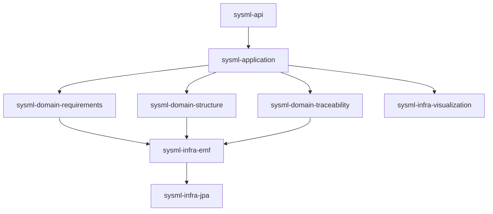
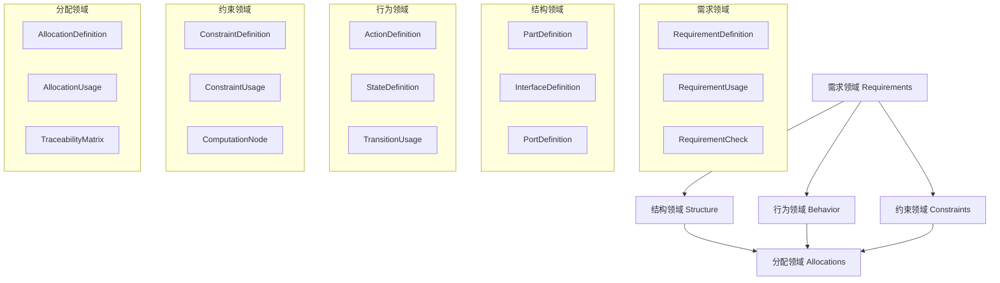
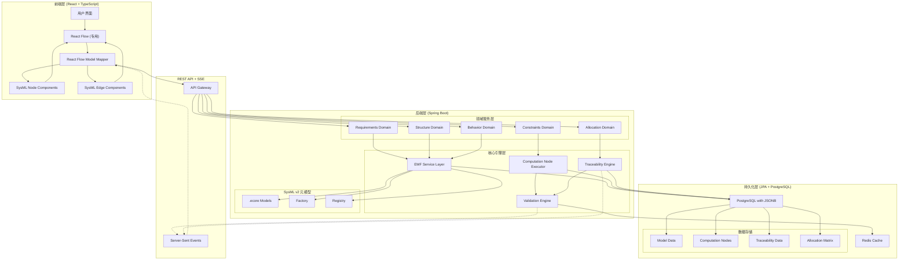

# SysML v2 建模平台系统设计文档

## 目录
1. [执行摘要](#1-执行摘要)
2. [核心理念与原则](#2-核心理念与原则)
3. [技术架构](#3-技术架构)
4. [EMF深度设计与持久化](#4-emf深度设计与持久化)
5. [SysML v2实现策略](#5-sysml-v2实现策略)
6. [前端可视化方案](#6-前端可视化方案)
7. [领域模型设计](#7-领域模型设计)
8. [数据流与控制流](#8-数据流与控制流)
9. [测试策略](#9-测试策略)
10. [部署架构](#10-部署架构)
11. [性能设计](#11-性能设计)
12. [安全设计](#12-安全设计)
13. [风险分析](#13-风险分析)
14. [实施路线图](#14-实施路线图)

---

## 1. 执行摘要

### 1.1 项目愿景
构建一个支持完整系统工程生命周期的SysML v2建模平台，从需求定义到系统架构设计、行为建模、约束验证，提供端到端的系统设计能力。通过EMF框架和创新的计算节点架构，实现符合标准、功能完整、易于扩展的建模解决方案。

### 1.2 核心价值主张
- **完整系统设计**：支持需求、结构、行为、约束、分配等完整的系统工程要素
- **标准合规**：严格遵循SysML v2 Pilot Implementation，确保与OMG标准完全兼容
- **EMF驱动**：充分利用EMF元模型机制，提供完整的M3/M2/M1/M0层次支持
- **计算节点创新**：将约束和计算可视化为图节点，支持多种执行引擎
- **建模闭环**：从需求到验证的完整追溯链，支持系统设计的全生命周期

### 1.3 关键设计决策
1. **EMF + SysML v2完整模型**：不仅支持需求，还包括Part、Interface、Action、State、Allocation等核心元素
2. **五大核心领域**：需求域、结构域、行为域、约束域、分配域的完整覆盖
3. **JPA + PostgreSQL持久化**：使用成熟的关系型数据库存储，JSONB字段存储模型数据
4. **计算节点架构**：抛弃传统OCL，采用可视化的计算节点处理所有约束和计算
5. **前端多图形库支持**：G6、React Flow、Cytoscape等，适应不同的可视化需求

### 1.4 系统能力范围
- **包含**：
  - 需求管理（RequirementDefinition/Usage）
  - 结构建模（PartDefinition/Usage、InterfaceDefinition/Usage、PortDefinition/Usage）
  - 行为建模（ActionDefinition/Usage、StateDefinition/Usage）
  - 约束定义（ConstraintDefinition/Usage）
  - 分配追踪（AllocationDefinition/Usage）
  - 计算节点引擎、多种可视化方案、RESTful API
- **不包含**：版本分支管理、实时协作编辑（第一版）

---

## 2. 核心理念与原则

### 2.1 SysML v2元模型层次理解

#### 2.1.1 四层元模型架构
```
M3层 (Meta-Meta-Model) - MOF
    ↓ instance-of
M2层 (Meta-Model) - SysML.ecore中的EClass定义
    ↓ instance-of  
M1层 (Model) - 用户创建的模型元素实例
    ↓ instance-of
M0层 (Runtime) - 系统运行时的实际对象
```

#### 2.1.2 在EMF中的映射
- **M3→EMF核心**：Ecore元模型（EClass, EAttribute, EReference）
- **M2→SysML.ecore**：RequirementDefinition.class, RequirementUsage.class等EClass
- **M1→EObject实例**：通过SysMLFactory创建的具体需求对象
- **M0→Java对象**：运行时的RequirementDefinitionImpl实例

#### 2.1.3 关键理解点
1. **M2不是我们创建的**：SysML v2 Pilot项目已定义好M2层，我们只需注册和使用
2. **M1是用户数据**：用户创建的每个需求都是M1层的EObject实例
3. **Definition vs Usage**：都是M1层概念，Definition是类型模板，Usage是使用实例

### 2.2 EMF框架深度利用原则

#### 2.2.1 元模型驱动
- **EPackage注册机制**：利用EMF的Package Registry自动管理类型系统
- **EFactory模式**：通过工厂方法确保类型安全的对象创建
- **EClass反射**：利用getEAllStructuralFeatures()实现通用的属性操作

#### 2.2.2 模型操作原生化
```java
// 正确：利用EMF原生能力
EObject reqDef = SysMLFactory.eINSTANCE.createRequirementDefinition();
reqDef.eSet(SysMLPackage.Literals.REQUIREMENT_DEFINITION__REQ_ID, "REQ-001");

// 错误：绕过EMF机制
RequirementDefinition reqDef = new RequirementDefinitionImpl();
reqDef.setReqId("REQ-001"); // 绕过了EMF的通知机制
```

#### 2.2.3 变更通知机制
- **EContentAdapter**：监听模型树的所有变更
- **Notification**：细粒度的属性变更事件
- **Command模式**：所有修改通过Command封装，支持撤销/重做

### 2.3 JPA + PostgreSQL持久化策略

#### 2.3.1 EMF模型序列化方案
1. **JSONB存储**：EMF模型序列化为JSON存储在PostgreSQL JSONB字段
2. **索引优化**：对常用查询路径建立JSONB索引
3. **版本控制**：通过版本字段实现乐观锁
4. **变更追踪**：审计表记录模型变更历史

#### 2.3.2 持久化实现策略
```java
// EMF模型到JSONB的转换
@Entity
@Table(name = "sysml_models")
public class SysMLModelEntity {
    @Id
    private String id;
    
    @Type(type = "jsonb")
    @Column(columnDefinition = "jsonb")
    private String modelData;  // EMF模型的JSON序列化
    
    @Version
    private Long version;  // 乐观锁版本
    
    private String eClass;  // 元素类型
    private Instant createdAt;
    private Instant updatedAt;
}
```

#### 2.3.3 查询优化策略
- **DTO投影**：只返回需要的字段，减少数据传输
- **懒加载实现**：通过引用ID实现关联的懒加载
- **缓存机制**：Redis缓存常用模型元素

### 2.4 计算节点架构原则

#### 2.4.1 计算节点概念
```typescript
// 计算节点：将约束和计算可视化为图中的节点
interface ComputationNode {
    id: string;
    type: 'constraint' | 'calculation' | 'validation';
    inputs: Port[];      // 输入端口
    outputs: Port[];     // 输出端口
    executor: ExecutorType;  // JavaScript, Python, Excel等
    code: string;        // 计算逻辑
    debug: boolean;      // 可调试
}
```

#### 2.4.2 替代OCL的优势
- **可视化**：计算逻辑作为节点直接显示在图中
- **可调试**：可以设置断点，查看中间值
- **多语言**：支持JavaScript、Python、Excel公式等
- **易理解**：业务人员也能理解的图形化表达

### 2.5 设计原则总结

#### 2.5.1 SOLID原则应用
- **单一职责**：每个服务类只负责一个领域
- **开闭原则**：通过EMF扩展点机制实现扩展
- **里氏替换**：所有EObject可互换使用
- **接口隔离**：细粒度的服务接口
- **依赖倒置**：依赖EMF抽象而非具体实现

#### 2.5.2 DDD领域驱动设计
- **限界上下文**：需求域、结构域、约束域清晰分离
- **聚合根**：RequirementDefinition作为需求聚合根
- **值对象**：reqId, text等作为值对象
- **领域事件**：需求创建、修改、删除事件

#### 2.5.3 MECE原则（Mutually Exclusive, Collectively Exhaustive）
- **互斥性**：各领域职责不重叠
- **完备性**：功能完整覆盖需求管理
- **依赖清晰**：DAG依赖图，无循环依赖

---

## 3. 技术架构

### 3.1 技术栈选型

#### 3.1.1 核心技术栈
| 层次 | 技术选型 | 版本 | 选择理由 |
|------|---------|------|----------|
| 前端框架 | React + TypeScript | 18.x + 5.x | 成熟的前端技术栈 |
| 图形库 | React Flow/G6/Cytoscape | Latest | 灵活的图形渲染选项 |
| API层 | Spring Boot + REST | 3.x | 简单高效的API设计 |
| 模型框架 | Eclipse EMF | 2.35.0 | SysML v2官方基础 |
| 持久化 | JPA + PostgreSQL | 3.x + 15.x | JSONB存储EMF模型 |
| 缓存 | Redis | 7.x | 模型缓存与会话管理 |
| 构建工具 | Maven | 3.9.x | Java标准构建 |
| 计算引擎 | GraalVM/Pyodide | Latest | 多语言计算执行 |

#### 3.1.2 技术选型深度分析

**为什么选择EMF而不是纯JPA？**
1. **模型本质**：SysML v2是基于MOF的元模型，EMF是MOF的Java实现
2. **类型系统**：EMF提供了完整的元模型类型系统支持
3. **反射能力**：EMF的反射API可以通用地操作任何模型元素
4. **通知机制**：EMF的Adapter机制提供细粒度变更通知
5. **工业标准**：SysML v2 Pilot项目的标准实现

**为什么选择JPA+JSONB而不是CDO？**
1. **简化架构**：去掉CDO Server减少系统复杂度
2. **性能优化**：PostgreSQL JSONB原生查询性能优秀
3. **云原生**：更容易容器化和横向扩展
4. **调试便利**：可以直接查看和修改数据库中的JSON数据
5. **生态成熟**：JPA生态系统更加成熟和稳定

**为什么选择计算节点而不是OCL？**
1. **可视化**：计算逻辑可以作为节点显示在图中
2. **可调试**：支持断点调试和中间值查看
3. **多语言**：支持JavaScript、Python、Excel公式等
4. **易理解**：业务人员也能理解的图形化表达
5. **灵活扩展**：可以接入AI模型、REST API等外部计算

### 3.2 分层架构设计

#### 3.2.1 架构层次图
```
┌─────────────────────────────────────────────────────────┐
│                   Presentation Layer                     │
│                                                          │
│  ┌──────────────────────────────────────────────────┐  │
│  │           React + 多图形库支持                    │  │
│  │                                                  │  │
│  │  ┌────────┐ ┌────────┐ ┌────────┐ ┌────────┐  │  │
│  │  │Diagram │ │ Tree   │ │ Table  │ │ Form   │  │  │
│  │  │ View   │ │ View   │ │ View   │ │ View   │  │  │
│  │  └────────┘ └────────┘ └────────┘ └────────┘  │  │
│  └──────────────────────────────────────────────────┘  │
└─────────────────────────────────────────────────────────┘
                            ↓ REST API
┌─────────────────────────────────────────────────────────┐
│                      API Gateway Layer                   │
│                                                          │
│  ┌──────────────────────────────────────────────────┐  │
│  │          Spring REST Controllers                 │  │
│  │                                                  │  │
│  │  Query | Mutation | Subscription | Schema       │  │
│  └──────────────────────────────────────────────────┘  │
└─────────────────────────────────────────────────────────┘
                            ↓
┌─────────────────────────────────────────────────────────┐
│                  Application Service Layer               │
│                                                          │
│  ┌──────────┐ ┌──────────┐ ┌──────────┐ ┌──────────┐  │
│  │Requirement│ │Structure │ │Constraint│ │Traceability│ │
│  │  Service  │ │ Service  │ │ Service  │ │  Service  │  │
│  └──────────┘ └──────────┘ └──────────┘ └──────────┘  │
│                                                          │
│  ┌──────────────────────────────────────────────────┐  │
│  │         Transaction Boundary (Spring @TX)        │  │
│  └──────────────────────────────────────────────────┘  │
└─────────────────────────────────────────────────────────┘
                            ↓
┌─────────────────────────────────────────────────────────┐
│                    Domain Model Layer                    │
│                                                          │
│  ┌──────────────────────────────────────────────────┐  │
│  │              EMF Model (M1 Instances)            │  │
│  │                                                  │  │
│  │  RequirementDefinition | RequirementUsage        │  │
│  │  PartDefinition | PartUsage | Connection         │  │
│  └──────────────────────────────────────────────────┘  │
│                                                          │
│  ┌──────────────────────────────────────────────────┐  │
│  │            SysML v2 Metamodel (M2)               │  │
│  │         (from sysml-v2-pilot project)            │  │
│  └──────────────────────────────────────────────────┘  │
└─────────────────────────────────────────────────────────┘
                            ↓
┌─────────────────────────────────────────────────────────┐
│                  Infrastructure Layer                    │
│                                                          │
│  ┌──────────────────────────────────────────────────┐  │
│  │                  JPA + PostgreSQL                │  │
│  │                                                  │  │
│  │  Repository | Transaction | Query | Notification │  │
│  └──────────────────────────────────────────────────┘  │
│                                                          │
│  ┌──────────────────────────────────────────────────┐  │
│  │              Database (H2/PostgreSQL)            │  │
│  └──────────────────────────────────────────────────┘  │
└─────────────────────────────────────────────────────────┘
```

#### 3.2.2 各层职责定义

**表现层（Presentation Layer）**
- 职责：用户交互、图形渲染、事件处理
- 技术：React组件、React Flow/G6/Cytoscape、Fetch API
- 原则：声明式UI、响应式更新、组件复用

**API网关层（API Gateway Layer）**
- 职责：请求路由、协议转换、认证授权
- 技术：Spring REST、Spring Cache、SSE
- 原则：契约先行、批量优化、实时推送

**应用服务层（Application Service Layer）**
- 职责：业务流程编排、事务控制、领域协调
- 技术：Spring Service、@Transactional、Domain Events
- 原则：薄服务层、事务边界、领域隔离

**领域模型层（Domain Model Layer）**
- 职责：业务规则、模型操作、约束验证
- 技术：EMF EObject、JPA Transaction、计算节点
- 原则：领域驱动、模型中心、规则内聚

**基础设施层（Infrastructure Layer）**
- 职责：数据持久化、消息通信、系统集成
- 技术：PostgreSQL JSONB、Redis Cache、Event Bus
- 原则：技术中立、可替换、高可用

### 3.3 模块划分

#### 3.3.1 模块结构
```
sysml-platform/
├── sysml-platform-frontend/          # 前端模块
│   ├── sysml-web/                   # React应用
│   └── sysml-components/            # 可复用组件
│
├── sysml-platform-backend/          # 后端模块
│   ├── sysml-api/                  # REST API
│   ├── sysml-application/          # 应用服务
│   ├── sysml-domain/               # 领域模型
│   │   ├── sysml-domain-requirements/
│   │   ├── sysml-domain-structure/
│   │   └── sysml-domain-traceability/
│   ├── sysml-infrastructure/       # 基础设施
│   │   ├── sysml-infra-emf/
│   │   └── sysml-infra-jpa/
│   └── sysml-test/                 # 测试模块
│
└── sysml-platform-deployment/      # 部署配置
    ├── docker/
    ├── kubernetes/
    └── terraform/
```

#### 3.3.2 模块依赖关系


### 3.4 组件交互设计

#### 3.4.1 前后端交互流程
```
用户操作 → React组件 → REST API → Spring Controller
    ↓                                            ↓
响应更新 ← JSON Response ← Service处理 ← Domain操作
    ↓                                            ↓
UI刷新 ← Subscription推送 ← Event发布 ← 模型变更事件
```

#### 3.4.2 关键组件接口

**REST API定义**
```java
@RestController
@RequestMapping("/api/v1/requirements")
public class RequirementController {
    
    @GetMapping("/{id}")
    public RequirementDTO getRequirement(@PathVariable String id) {
        return requirementService.findById(id);
    }
    
    @GetMapping
    public Page<RequirementDTO> listRequirements(
        @PageableDefault(size = 20) Pageable pageable,
        @RequestParam(required = false) String search
    ) {
        return requirementService.findAll(search, pageable);
    }
    
    @PostMapping
    public RequirementDTO createRequirement(@RequestBody CreateRequirementRequest request) {
        return requirementService.create(request);
    }
    
    @PutMapping("/{id}")
    public RequirementDTO updateRequirement(
        @PathVariable String id,
        @RequestBody UpdateRequirementRequest request
    ) {
        return requirementService.update(id, request);
    }
    
    @DeleteMapping("/{id}")
    public void deleteRequirement(@PathVariable String id) {
        requirementService.delete(id);
    }
    
    // 计算节点操作
    @PostMapping("/{id}/computation-nodes")
    public void attachComputationNode(
        @PathVariable String id,
        @RequestBody ComputationNode node
    ) {
        requirementService.attachComputationNode(id, node);
    }
    
    // SSE实时推送
    @GetMapping(value = "/{id}/stream", produces = MediaType.TEXT_EVENT_STREAM_VALUE)
    public Flux<ServerSentEvent<RequirementEvent>> streamRequirementChanges(@PathVariable String id) {
        return requirementService.streamChanges(id)
            .map(event -> ServerSentEvent.<RequirementEvent>builder()
                .event(event.getType())
                .data(event)
                .build());
    }
}
```

**Service接口定义**
```java
public interface RequirementService {
    // 基于EMF的CRUD操作
    EObject createRequirementDefinition(String reqId, String text);
    EObject updateRequirementDefinition(String id, Map<String, Object> changes);
    void deleteRequirementDefinition(String id);
    
    // 查询操作
    List<EObject> findAllRequirementDefinitions();
    EObject findRequirementDefinitionById(String id);
    List<EObject> findRequirementsByText(String searchText);
    
    // 关系管理
    void createDeriveRelationship(String sourceId, String targetId);
    void createRefineRelationship(String sourceId, String targetId);
    
    // 验证操作
    ValidationResult validateRequirement(EObject requirement);
    List<String> detectCycles(Collection<EObject> requirements);
}
```
# SysML v2 建模平台系统设计文档 - 第二部分

## 4. EMF深度设计与持久化

### 4.1 EMF元模型管理

#### 4.1.1 EPackage注册策略
```java
public class EMFModelManager {
    private static final EMFModelManager INSTANCE = new EMFModelManager();
    private final Registry packageRegistry;
    
    private EMFModelManager() {
        this.packageRegistry = EPackage.Registry.INSTANCE;
        registerSysMLPackages();
    }
    
    private void registerSysMLPackages() {
        // 注册SysML v2核心包
        packageRegistry.put(SysMLPackage.eNS_URI, SysMLPackage.eINSTANCE);
        packageRegistry.put(KerMLPackage.eNS_URI, KerMLPackage.eINSTANCE);
        
        // 注册扩展包
        for (EPackage pkg : ExtensionRegistry.getExtensionPackages()) {
            packageRegistry.put(pkg.getNsURI(), pkg);
        }
    }
    
    public EClass getEClass(String className) {
        // 通过反射获取EClass
        return (EClass) SysMLPackage.eINSTANCE.getEClassifier(className);
    }
}
```

#### 4.1.2 EFactory使用模式
```java
public class SysMLModelFactory {
    private final SysMLFactory factory = SysMLFactory.eINSTANCE;
    
    public RequirementDefinition createRequirementDefinition(String reqId, String text) {
        // 使用工厂创建M1实例
        RequirementDefinition reqDef = factory.createRequirementDefinition();
        
        // 设置属性 - 使用EMF的eSet方法
        reqDef.eSet(SysMLPackage.Literals.REQUIREMENT_DEFINITION__REQ_ID, reqId);
        
        // 处理派生属性
        Documentation doc = factory.createDocumentation();
        doc.setBody(text);
        reqDef.getOwnedRelationship().add(doc);
        
        return reqDef;
    }
    
    public RequirementUsage createRequirementUsage(RequirementDefinition definition) {
        RequirementUsage usage = factory.createRequirementUsage();
        
        // 建立Definition-Usage关系
        usage.eSet(
            SysMLPackage.Literals.REQUIREMENT_USAGE__REQUIREMENT_DEFINITION,
            definition
        );
        
        // Usage继承Definition的特性
        inheritDefinitionFeatures(usage, definition);
        
        return usage;
    }
    
    private void inheritDefinitionFeatures(RequirementUsage usage, RequirementDefinition def) {
        // 通过EMF反射复制属性
        for (EAttribute attr : def.eClass().getEAllAttributes()) {
            if (!attr.isDerived() && !attr.isTransient()) {
                Object value = def.eGet(attr);
                if (value != null && usage.eClass().getEStructuralFeature(attr.getName()) != null) {
                    usage.eSet(usage.eClass().getEStructuralFeature(attr.getName()), value);
                }
            }
        }
    }
}
```

#### 4.1.3 EMF反射机制利用
```java
public class EMFReflectionUtil {
    
    /**
     * 通用的属性操作方法
     */
    public static void setProperty(EObject eObject, String propertyName, Object value) {
        EStructuralFeature feature = eObject.eClass().getEStructuralFeature(propertyName);
        if (feature != null) {
            eObject.eSet(feature, value);
        }
    }
    
    /**
     * 批量属性更新
     */
    public static void updateProperties(EObject eObject, Map<String, Object> properties) {
        for (Map.Entry<String, Object> entry : properties.entrySet()) {
            EStructuralFeature feature = eObject.eClass()
                .getEStructuralFeature(entry.getKey());
            if (feature != null && !feature.isDerived()) {
                eObject.eSet(feature, entry.getValue());
            }
        }
    }
    
    /**
     * 深度克隆EObject
     */
    public static EObject deepClone(EObject original) {
        Copier copier = new Copier();
        EObject result = copier.copy(original);
        copier.copyReferences();
        return result;
    }
    
    /**
     * 获取所有可编辑属性
     */
    public static List<EStructuralFeature> getEditableFeatures(EClass eClass) {
        return eClass.getEAllStructuralFeatures().stream()
            .filter(f -> !f.isDerived() && !f.isTransient() && f.isChangeable())
            .collect(Collectors.toList());
    }
}
```

#### 4.1.4 计算节点验证框架
```java
@Component
public class ComputationNodeValidator {
    
    private final ComputationExecutor executor;
    private final ModelGraphBuilder graphBuilder;
    
    public ValidationResult validate(EObject element) {
        // 构建包含计算节点的模型图
        ModelGraph graph = graphBuilder.build(element);
        
        // 找出所有验证节点
        List<ComputationNode> validationNodes = graph.getNodes().stream()
            .filter(n -> n.getType() == NodeType.VALIDATION)
            .collect(Collectors.toList());
        
        // 执行所有验证节点
        List<ValidationError> errors = new ArrayList<>();
        for (ComputationNode node : validationNodes) {
            ExecutionResult result = executor.execute(node);
            if (!result.isSuccess()) {
                errors.add(new ValidationError(
                    node.getName(),
                    result.getMessage(),
                    element
                ));
            }
        }
        
        return new ValidationResult(errors.isEmpty(), errors);
    }
    
    private boolean validateRequirementCheck(RequirementDefinition req, DiagnosticChain chain) {
        // 实现 allTrue(assumptions) implies allTrue(constraints) 逻辑
        List<ConstraintUsage> assumptions = req.getAssumedConstraint();
        List<ConstraintUsage> constraints = req.getRequiredConstraint();
        
        boolean assumptionsTrue = assumptions.stream()
            .allMatch(this::evaluateConstraint);
            
        if (assumptionsTrue) {
            boolean constraintsTrue = constraints.stream()
                .allMatch(this::evaluateConstraint);
            
            if (!constraintsTrue) {
                chain.add(new BasicDiagnostic(
                    Diagnostic.ERROR,
                    "RequirementCheck",
                    0,
                    "Required constraints not satisfied when assumptions are true",
                    new Object[]{req}
                ));
                return false;
            }
        }
        
        return true;
    }
    
    private boolean evaluateConstraint(ConstraintUsage constraint) {
        // 实际的约束评估逻辑
        return true; // 简化实现
    }
}
```

### 4.2 JPA持久化深度设计

#### 4.2.1 EMF模型序列化策略
```java
@Component
public class EMFModelSerializer {
    
    private final ObjectMapper objectMapper;
    
    public EMFModelSerializer() {
        this.objectMapper = new ObjectMapper();
        // 配置EMF特定的序列化
        SimpleModule module = new SimpleModule();
        module.addSerializer(EObject.class, new EObjectSerializer());
        module.addDeserializer(EObject.class, new EObjectDeserializer());
        objectMapper.registerModule(module);
    }
    
    /**
     * 将EMF模型序列化为JSON
     */
    public String serialize(EObject eObject) {
        Map<String, Object> json = new HashMap<>();
        json.put("eClass", eObject.eClass().getName());
        json.put("nsURI", eObject.eClass().getEPackage().getNsURI());
        
        // 序列化所有属性
        Map<String, Object> attributes = new HashMap<>();
        for (EAttribute attr : eObject.eClass().getEAllAttributes()) {
            if (eObject.eIsSet(attr)) {
                attributes.put(attr.getName(), eObject.eGet(attr));
            }
        }
        json.put("attributes", attributes);
        
        // 序列化引用（只存储ID）
        Map<String, List<String>> references = new HashMap<>();
        for (EReference ref : eObject.eClass().getEAllReferences()) {
            if (eObject.eIsSet(ref)) {
                references.put(ref.getName(), getReferencedIds(eObject.eGet(ref)));
            }
        }
        json.put("references", references);
        
        return objectMapper.writeValueAsString(json);
    }
    
    /**
     * 反序列化JSON为EMF模型
     */
    public EObject deserialize(String json) {
        Map<String, Object> data = objectMapper.readValue(json, Map.class);
        String eClassName = (String) data.get("eClass");
        String nsURI = (String) data.get("nsURI");
        
        // 获取EPackage和EClass
        EPackage ePackage = EPackage.Registry.INSTANCE.getEPackage(nsURI);
        EClass eClass = (EClass) ePackage.getEClassifier(eClassName);
        
        // 创建实例
        EObject eObject = EcoreUtil.create(eClass);
        
        // 恢复属性
        Map<String, Object> attributes = (Map<String, Object>) data.get("attributes");
        for (Map.Entry<String, Object> entry : attributes.entrySet()) {
            EAttribute attr = eClass.getEAttribute(entry.getKey());
            if (attr != null) {
                eObject.eSet(attr, entry.getValue());
            }
        }
        
        return eObject;
    }
}
```

#### 4.2.2 JPA实体管理
```java
@Component
public class ModelPersistenceService {
    
    private final EntityManager entityManager;
    private final EMFModelSerializer serializer;
    
    @Transactional
    public String saveModel(EObject model) {
        // 序列化EMF模型
        String jsonData = serializer.serialize(model);
        
        // 创建JPA实体
        SysMLModelEntity entity = new SysMLModelEntity();
        entity.setId(EcoreUtil.getIdentification(model));
        entity.setEClass(model.eClass().getName());
        entity.setModelData(jsonData);
        entity.setCreatedAt(Instant.now());
        entity.setUpdatedAt(Instant.now());
        
        // 保存到数据库
        entityManager.persist(entity);
        
        return entity.getId();
    }
    
    @Transactional(readOnly = true)
    public EObject loadModel(String id) {
        SysMLModelEntity entity = entityManager.find(SysMLModelEntity.class, id);
        if (entity == null) {
            throw new ModelNotFoundException("Model not found: " + id);
        }
        
        // 反序列化为EMF模型
        return serializer.deserialize(entity.getModelData());
    }
    
    @Transactional
    public void updateModel(String id, EObject model) {
        SysMLModelEntity entity = entityManager.find(SysMLModelEntity.class, id);
        if (entity == null) {
            throw new ModelNotFoundException("Model not found: " + id);
        }
        
        // 更新模型数据
        entity.setModelData(serializer.serialize(model));
        entity.setUpdatedAt(Instant.now());
        entity.setVersion(entity.getVersion() + 1);
        
        entityManager.merge(entity);
    }
}
```

#### 4.2.3 JSONB查询优化
```java
@Repository
public class ModelQueryRepository {
    
    private final JdbcTemplate jdbcTemplate;
    
    /**
     * 使用JSONB查询查找需求
     */
    public List<Map<String, Object>> findRequirementsByText(String searchText) {
        String sql = """
            SELECT id, model_data
            FROM sysml_models
            WHERE e_class = 'RequirementDefinition'
            AND model_data @> '{"attributes": {"text": ?}}'
            """;
        
        return jdbcTemplate.queryForList(sql, searchText);
    }
    
    /**
     * 使用JSONB路径查询
     */
    public List<String> findModelsByPath(String jsonPath, Object value) {
        String sql = """
            SELECT id
            FROM sysml_models
            WHERE jsonb_path_exists(model_data, ?, ?::jsonb)
            """;
        
        return jdbcTemplate.queryForList(sql, String.class, jsonPath, value);
    }
    
    /**
     * 创建JSONB索引以优化查询
     */
    public void createIndexes() {
        jdbcTemplate.execute("""
            CREATE INDEX idx_model_eclass ON sysml_models(e_class);
            CREATE INDEX idx_model_data_gin ON sysml_models USING gin(model_data);
            CREATE INDEX idx_model_req_text ON sysml_models ((model_data->'attributes'->>'text'))
            WHERE e_class = 'RequirementDefinition';
            """);
        }
    }
    
    public List<RequirementDefinition> getAllRequirementDefinitions() {
        String sql = """
            SELECT model_data
            FROM sysml_models
            WHERE e_class = 'RequirementDefinition'
            ORDER BY created_at DESC
            """;
        
        return jdbcTemplate.query(sql, (rs, rowNum) -> {
            String json = rs.getString("model_data");
            return (RequirementDefinition) serializer.deserialize(json);
        });
    }
    
    public RequirementDefinition findByReqId(String reqId) {
        String sql = """
            SELECT model_data
            FROM sysml_models
            WHERE e_class = 'RequirementDefinition'
            AND model_data->'attributes'->>'reqId' = ?
            LIMIT 1
            """;
        
        List<String> results = jdbcTemplate.queryForList(sql, String.class, reqId);
        if (results.isEmpty()) {
            return null;
        }
        
        return (RequirementDefinition) serializer.deserialize(results.get(0));
    }
}
```

#### 4.2.4 缓存优化策略
```java
@Component
public class ModelCacheService {
    
    private final RedisTemplate<String, String> redisTemplate;
    private final EMFModelSerializer serializer;
    
    /**
     * 缓存模型对象
     */
    public void cacheModel(String id, EObject model) {
        String key = "model:" + id;
        String json = serializer.serialize(model);
        
        redisTemplate.opsForValue().set(key, json, Duration.ofMinutes(30));
    }
    
    /**
     * 从缓存获取模型
     */
    public EObject getCachedModel(String id) {
        String key = "model:" + id;
        String json = redisTemplate.opsForValue().get(key);
        
        if (json != null) {
            return serializer.deserialize(json);
        }
        return null;
    }
    
    /**
     * 查询结果缓存
     */
    public List<EObject> getCachedQuery(String queryKey) {
        String key = "query:" + queryKey;
        List<String> jsonList = redisTemplate.opsForList().range(key, 0, -1);
        
        if (jsonList != null && !jsonList.isEmpty()) {
            return jsonList.stream()
                .map(serializer::deserialize)
                .collect(Collectors.toList());
        }
        return null;
    }
    
    /**
     * 缓存查询结果
     */
    public void cacheQuery(String queryKey, List<EObject> results) {
        String key = "query:" + queryKey;
        
        // 清除旧缓存
        redisTemplate.delete(key);
        
        // 存储新结果
        List<String> jsonList = results.stream()
            .map(serializer::serialize)
            .collect(Collectors.toList());
        
        redisTemplate.opsForList().rightPushAll(key, jsonList);
        redisTemplate.expire(key, Duration.ofMinutes(5));
    }
}
```

---

## 5. 计算节点架构与SysML v2实现

### 5.0 计算节点架构设计

#### 5.0.1 核心概念
计算节点是将传统的OCL约束和计算逻辑可视化为图中节点的创新架构，使得：
- 约束和计算成为可见的图形元素
- 支持多语言执行（JavaScript、Python、Excel等）
- 提供可调试的计算流程
- 实现数据流的可视化追踪

#### 5.0.2 计算节点类型定义
```typescript
enum ComputationNodeType {
    CONSTRAINT = 'constraint',     // 约束验证节点
    CALCULATION = 'calculation',   // 数值计算节点
    VALIDATION = 'validation',     // 规则验证节点
    AGGREGATION = 'aggregation',   // 数据聚合节点
    TRANSFORMATION = 'transformation', // 数据转换节点
    DECISION = 'decision'          // 决策分支节点
}

interface ComputationNode {
    id: string;
    name: string;
    type: ComputationNodeType;
    
    // 端口定义
    inputs: InputPort[];
    outputs: OutputPort[];
    
    // 执行器配置
    executor: {
        type: 'javascript' | 'python' | 'excel' | 'rest' | 'ai';
        runtime?: 'graalvm' | 'pyodide' | 'native';
        code: string;
        dependencies?: string[];
    };
    
    // 调试配置
    debug: {
        enabled: boolean;
        breakpoints?: number[];
        watchVariables?: string[];
    };
    
    // 可视化配置
    visualization: {
        position: { x: number; y: number };
        color: string;
        icon: string;
        showCode: boolean;
    };
}
```

#### 5.0.3 执行器实现
```java
@Component
public class ComputationExecutorService {
    
    private final Map<String, ExecutorStrategy> executors = new HashMap<>();
    
    public ComputationExecutorService() {
        // 注册各种执行器
        executors.put("javascript", new JavaScriptExecutor());
        executors.put("python", new PyodideExecutor());
        executors.put("excel", new ExcelFormulaExecutor());
        executors.put("rest", new RestApiExecutor());
        executors.put("ai", new AIModelExecutor());
    }
    
    /**
     * 执行计算节点
     */
    public ExecutionResult execute(ComputationNode node, Map<String, Object> inputs) {
        ExecutorStrategy executor = executors.get(node.getExecutor().getType());
        
        try {
            // 准备执行上下文
            ExecutionContext context = new ExecutionContext();
            context.setInputs(inputs);
            context.setCode(node.getExecutor().getCode());
            context.setDebugEnabled(node.getDebug().isEnabled());
            
            // 执行计算
            Object result = executor.execute(context);
            
            // 记录执行历史
            recordExecution(node, inputs, result);
            
            return ExecutionResult.success(result);
            
        } catch (Exception e) {
            return ExecutionResult.failure(e.getMessage());
        }
    }
    
    /**
     * JavaScript执行器实现
     */
    class JavaScriptExecutor implements ExecutorStrategy {
        private final ScriptEngine engine = new ScriptEngineManager()
            .getEngineByName("graal.js");
        
        @Override
        public Object execute(ExecutionContext context) {
            Bindings bindings = engine.createBindings();
            context.getInputs().forEach(bindings::put);
            
            return engine.eval(context.getCode(), bindings);
        }
    }
}
```

#### 5.0.4 与EMF模型的集成
```java
@Service
public class ComputationNodeIntegrationService {
    
    /**
     * 将计算节点附加到EMF模型元素
     */
    public void attachComputationNode(EObject modelElement, ComputationNode node) {
        // 创建扩展属性存储计算节点引用
        EAnnotation annotation = EcoreFactory.eINSTANCE.createEAnnotation();
        annotation.setSource("computation.node");
        annotation.getDetails().put("nodeId", node.getId());
        annotation.getDetails().put("type", node.getType().toString());
        
        modelElement.getEAnnotations().add(annotation);
        
        // 建立数据绑定
        bindDataPorts(modelElement, node);
    }
    
    /**
     * 自动创建约束验证节点
     */
    public ComputationNode createConstraintNode(ConstraintUsage constraint) {
        ComputationNode node = new ComputationNode();
        node.setType(ComputationNodeType.CONSTRAINT);
        node.setName(constraint.getName() + "_validator");
        
        // 从OCL表达式转换为JavaScript
        String jsCode = convertOCLToJavaScript(constraint.getExpression());
        node.getExecutor().setCode(jsCode);
        
        // 自动识别输入参数
        List<InputPort> inputs = extractInputPorts(constraint);
        node.setInputs(inputs);
        
        // 输出为布尔值
        OutputPort output = new OutputPort("result", "boolean");
        node.setOutputs(Arrays.asList(output));
        
        return node;
    }
}
```

### 5.1 Definition/Usage模式实现

#### 5.1.1 概念理解
```
Definition (类型模板)              Usage (实例使用)
┌─────────────────────┐          ┌─────────────────────┐
│RequirementDefinition│<─────────│ RequirementUsage    │
│                     │          │                     │
│ - reqId: String     │          │ - inherits reqId    │
│ - text: String      │          │ - inherits text     │
│ - subject: Subject  │          │ - instance subject  │
└─────────────────────┘          └─────────────────────┘
        ↑                                ↑
        │ type-of                        │ instance-of
        │                                │
   [用户定义的需求类型]              [项目中的具体需求]
```

#### 5.1.2 实现策略
```java
@Service
public class RequirementDefinitionUsageService {
    
    private final SysMLModelFactory factory;
    private final ModelPersistenceService persistenceService;
    
    /**
     * 创建Definition - 作为类型模板
     */
    public RequirementDefinition createDefinition(String typeName, String template) {
        RequirementDefinition definition = factory.createRequirementDefinition();
        
        // Definition定义类型模板
        definition.setName(typeName);
        definition.setReqId(typeName + "_TEMPLATE");
        definition.setText(template);
        
        // 设置约束模板
        definition.getAssumedConstraint().addAll(createDefaultAssumptions());
        definition.getRequiredConstraint().addAll(createDefaultConstraints());
        
        return resourceManager.saveDefinition(definition);
    }
    
    /**
     * 创建Usage - 基于Definition的实例
     */
    public RequirementUsage createUsage(RequirementDefinition definition, 
                                        String instanceId, 
                                        Map<String, Object> instanceData) {
        RequirementUsage usage = factory.createRequirementUsage();
        
        // 关联Definition
        usage.setRequirementDefinition(definition);
        
        // 继承Definition的属性
        usage.setReqId(instanceId);
        usage.setText(definition.getText()); // 继承模板文本
        
        // 实例化特定值
        if (instanceData.containsKey("subject")) {
            usage.setSubjectParameter(createSubject(instanceData.get("subject")));
        }
        
        // 实例化约束
        instantiateConstraints(usage, definition);
        
        return resourceManager.saveUsage(usage);
    }
    
    /**
     * 批量创建Usage - 基于同一Definition
     */
    public List<RequirementUsage> createBatchUsages(RequirementDefinition definition,
                                                    List<Map<String, Object>> instances) {
        return instances.stream()
            .map(data -> createUsage(
                definition,
                (String) data.get("reqId"),
                data
            ))
            .collect(Collectors.toList());
    }
}
```

### 5.2 RequirementCheck机制实现

#### 5.2.1 RequirementCheck继承体系
```java
// 基础约束检查
public abstract class RequirementConstraintCheck {
    protected List<ConstraintUsage> assumptions;
    protected List<ConstraintUsage> constraints;
    
    public boolean check() {
        // 核心逻辑：assumptions implies constraints
        boolean assumptionsHold = allTrue(assumptions);
        if (assumptionsHold) {
            return allTrue(constraints);
        }
        return true; // 假设不成立时，约束不需要检查
    }
    
    protected boolean allTrue(List<ConstraintUsage> constraints) {
        return constraints.stream().allMatch(this::evaluate);
    }
    
    protected abstract boolean evaluate(ConstraintUsage constraint);
}

// RequirementCheck实现
public class RequirementCheck extends RequirementConstraintCheck {
    private Usage subject;
    private List<PartUsage> actors;
    private List<PartUsage> stakeholders;
    private List<RequirementCheck> subrequirements;
    private List<ConcernUsage> concerns;
    
    @Override
    protected boolean evaluate(ConstraintUsage constraint) {
        // 实现具体的约束评估逻辑
        if (constraint instanceof FunctionalConstraint) {
            return evaluateFunctional((FunctionalConstraint) constraint);
        } else if (constraint instanceof PerformanceConstraint) {
            return evaluatePerformance((PerformanceConstraint) constraint);
        }
        // ... 其他类型
        return true;
    }
}
```

#### 5.2.2 专门化RequirementCheck类型
```java
@Component
public class SpecializedRequirementCheckFactory {
    
    public FunctionalRequirementCheck createFunctionalCheck(RequirementDefinition req) {
        FunctionalRequirementCheck check = new FunctionalRequirementCheck();
        
        // 设置Action作为subject
        Action action = findOrCreateAction(req);
        check.setSubject(action);
        
        // 功能性约束
        check.setConstraints(createFunctionalConstraints(req));
        
        return check;
    }
    
    public InterfaceRequirementCheck createInterfaceCheck(RequirementDefinition req) {
        InterfaceRequirementCheck check = new InterfaceRequirementCheck();
        
        // 设置Interface作为subject
        Interface iface = findOrCreateInterface(req);
        check.setSubject(iface);
        
        // 接口约束
        check.setConstraints(createInterfaceConstraints(req));
        
        return check;
    }
    
    public PerformanceRequirementCheck createPerformanceCheck(RequirementDefinition req) {
        PerformanceRequirementCheck check = new PerformanceRequirementCheck();
        
        // 设置AttributeValue作为subject
        AttributeValue value = findOrCreateAttributeValue(req);
        check.setSubject(value);
        
        // 性能约束
        check.setConstraints(createPerformanceConstraints(req));
        
        return check;
    }
    
    public PhysicalRequirementCheck createPhysicalCheck(RequirementDefinition req) {
        PhysicalRequirementCheck check = new PhysicalRequirementCheck();
        
        // 设置Part作为subject
        Part part = findOrCreatePart(req);
        check.setSubject(part);
        
        // 物理约束
        check.setConstraints(createPhysicalConstraints(req));
        
        return check;
    }
    
    public DesignConstraintCheck createDesignCheck(RequirementDefinition req) {
        DesignConstraintCheck check = new DesignConstraintCheck();
        
        // 设计约束
        check.setConstraints(createDesignConstraints(req));
        
        return check;
    }
}
```

### 5.3 需求层次关系实现

#### 5.3.1 Derive/Refine关系管理
```java
@Service
public class RequirementHierarchyService {
    
    private final ModelPersistenceService persistenceService;
    
    /**
     * 创建Derive关系 - 派生需求
     */
    public DeriveRequirementUsage createDeriveRelationship(
            RequirementDefinition source,
            RequirementDefinition target) {
        
        // 检查循环依赖
        if (wouldCreateCycle(source, target, DeriveRequirementUsage.class)) {
            throw new CyclicDependencyException("Derive relationship would create cycle");
        }
        
        DeriveRequirementUsage derive = SysMLFactory.eINSTANCE.createDeriveRequirementUsage();
        derive.setSource(source);
        derive.setTarget(target);
        
        // 添加到源需求的派生关系中
        source.getOwnedRelationship().add(derive);
        
        return derive;
    }
    
    /**
     * 创建Refine关系 - 细化需求
     */
    public Refinement createRefineRelationship(
            RequirementDefinition general,
            RequirementDefinition specific) {
        
        // 检查循环依赖
        if (wouldCreateCycle(general, specific, Refinement.class)) {
            throw new CyclicDependencyException("Refine relationship would create cycle");
        }
        
        Refinement refine = SysMLFactory.eINSTANCE.createRefinement();
        refine.setGeneral(general);
        refine.setSpecific(specific);
        
        // 添加到特化需求中
        specific.getOwnedRelationship().add(refine);
        
        return refine;
    }
    
    /**
     * 检测循环依赖
     */
    private boolean wouldCreateCycle(Element source, Element target, Class<?> relType) {
        Set<Element> visited = new HashSet<>();
        return hasCycleDFS(target, source, relType, visited);
    }
    
    private boolean hasCycleDFS(Element current, Element target, 
                                Class<?> relType, Set<Element> visited) {
        if (current.equals(target)) {
            return true;
        }
        
        if (visited.contains(current)) {
            return false;
        }
        
        visited.add(current);
        
        // 遍历所有相同类型的关系
        for (Relationship rel : current.getOwnedRelationship()) {
            if (relType.isInstance(rel)) {
                Element next = getTargetElement(rel);
                if (next != null && hasCycleDFS(next, target, relType, visited)) {
                    return true;
                }
            }
        }
        
        return false;
    }
    
    /**
     * 构建需求层次树
     */
    public RequirementTree buildHierarchyTree(RequirementDefinition root) {
        RequirementTree tree = new RequirementTree(root);
        
        // 递归构建子需求
        for (RequirementDefinition sub : root.getSubrequirements()) {
            tree.addChild(buildHierarchyTree(sub));
        }
        
        // 添加派生需求
        for (DeriveRequirementUsage derive : getDerivedRequirements(root)) {
            tree.addDerived(derive.getTarget());
        }
        
        // 添加细化需求
        for (Refinement refine : getRefinements(root)) {
            tree.addRefined(refine.getSpecific());
        }
        
        return tree;
    }
}
```

### 5.4 主体三元关系实现

#### 5.4.1 Subject/Actors/Stakeholders管理
```java
@Service
public class RequirementRelationshipService {
    
    /**
     * 设置需求主体
     */
    public void setSubject(RequirementDefinition requirement, Usage subject) {
        // 创建SubjectMembership
        SubjectMembership membership = SysMLFactory.eINSTANCE.createSubjectMembership();
        membership.setOwnedSubjectParameter(subject);
        
        // 确保只有一个主体
        requirement.getFeatureMembership().removeIf(m -> m instanceof SubjectMembership);
        requirement.getFeatureMembership().add(membership);
        
        // 更新input参数
        if (!requirement.getInput().isEmpty()) {
            requirement.getInput().set(0, subject);
        } else {
            requirement.getInput().add(subject);
        }
    }
    
    /**
     * 添加参与者
     */
    public void addActor(RequirementDefinition requirement, PartUsage actor) {
        // 创建ActorMembership
        ActorMembership membership = SysMLFactory.eINSTANCE.createActorMembership();
        membership.setOwnedActorParameter(actor);
        
        requirement.getFeatureMembership().add(membership);
        requirement.getActorParameter().add(actor);
    }
    
    /**
     * 添加利益相关者
     */
    public void addStakeholder(RequirementDefinition requirement, PartUsage stakeholder) {
        // 创建StakeholderMembership
        StakeholderMembership membership = SysMLFactory.eINSTANCE.createStakeholderMembership();
        membership.setOwnedStakeholderParameter(stakeholder);
        
        requirement.getFeatureMembership().add(membership);
        requirement.getStakeholderParameter().add(stakeholder);
    }
    
    /**
     * 获取需求的完整三元关系
     */
    public RequirementTriad getTriad(RequirementDefinition requirement) {
        RequirementTriad triad = new RequirementTriad();
        
        // 获取主体
        triad.setSubject(requirement.getSubjectParameter());
        
        // 获取所有参与者
        triad.setActors(requirement.getActorParameter());
        
        // 获取所有利益相关者
        triad.setStakeholders(requirement.getStakeholderParameter());
        
        return triad;
    }
    
    /**
     * 验证三元关系完整性
     */
    public ValidationResult validateTriad(RequirementDefinition requirement) {
        List<String> errors = new ArrayList<>();
        
        if (requirement.getSubjectParameter() == null) {
            errors.add("Requirement must have a subject");
        }
        
        if (requirement.getActorParameter().isEmpty()) {
            errors.add("Requirement should have at least one actor");
        }
        
        if (requirement.getStakeholderParameter().isEmpty()) {
            errors.add("Requirement should have at least one stakeholder");
        }
        
        return new ValidationResult(errors.isEmpty(), errors);
    }
}
```

### 5.2 结构建模（Part/Interface/Port）实现

#### 5.2.1 PartDefinition与PartUsage

**M2层定义（基于SysML.ecore）**
```java
@Entity
@Table(name = "sysml_part_definitions")
public class PartDefinition extends ItemDefinition {
    
    @OneToMany(cascade = CascadeType.ALL, fetch = FetchType.LAZY)
    @JoinColumn(name = "owning_part_definition_id")
    private List<PartUsage> parts = new ArrayList<>();
    
    @OneToMany(cascade = CascadeType.ALL, fetch = FetchType.LAZY)
    @JoinColumn(name = "owning_part_definition_id")
    private List<PortUsage> ports = new ArrayList<>();
    
    @OneToMany(cascade = CascadeType.ALL, fetch = FetchType.LAZY)
    @JoinColumn(name = "owning_part_definition_id")
    private List<InterfaceUsage> interfaces = new ArrayList<>();
    
    @OneToMany(cascade = CascadeType.ALL, fetch = FetchType.LAZY)
    @JoinColumn(name = "owning_part_definition_id")
    private List<ConnectionUsage> connections = new ArrayList<>();
    
    // 结构约束
    @OneToMany(cascade = CascadeType.ALL, fetch = FetchType.LAZY)
    @JoinColumn(name = "part_definition_id")
    private List<ComputationNode> structuralConstraints = new ArrayList<>();
}

@Entity
@Table(name = "sysml_part_usages")
public class PartUsage extends ItemUsage {
    
    @ManyToOne(fetch = FetchType.LAZY)
    @JoinColumn(name = "part_definition_id")
    private PartDefinition partDefinition;
    
    // 多重性约束
    @Embedded
    private Multiplicity multiplicity;
    
    // 几何和物理属性
    @OneToMany(cascade = CascadeType.ALL, fetch = FetchType.LAZY)
    @JoinColumn(name = "part_usage_id")
    private List<AttributeUsage> physicalProperties = new ArrayList<>();
}
```

**REST API实现**
```java
@RestController
@RequestMapping("/api/v1/parts")
public class PartController {
    
    @PostMapping("/definitions")
    public PartDefinitionDTO createPartDefinition(
        @RequestBody CreatePartDefinitionRequest request) {
        
        PartDefinition partDef = partService.createDefinition(request);
        
        // 自动创建结构验证计算节点
        ComputationNode structuralValidator = computationService.createNode(
            ComputationNodeType.VALIDATION,
            "validate_part_structure",
            generateStructuralValidationCode(partDef)
        );
        
        partDef.getStructuralConstraints().add(structuralValidator);
        
        return partMapper.toDTO(partService.save(partDef));
    }
    
    @PostMapping("/definitions/{defId}/parts")
    public PartUsageDTO addPartUsage(
        @PathVariable String defId,
        @RequestBody CreatePartUsageRequest request) {
        
        PartUsage partUsage = partService.createUsage(defId, request);
        
        // 发布结构变更事件
        eventPublisher.publishEvent(new StructuralChangeEvent(
            defId, StructuralChangeType.PART_ADDED, partUsage.getId()
        ));
        
        return partMapper.toDTO(partUsage);
    }
}
```

#### 5.2.2 InterfaceDefinition与InterfaceUsage

```java
@Entity
@Table(name = "sysml_interface_definitions")
public class InterfaceDefinition extends ConnectionDefinition {
    
    @OneToMany(cascade = CascadeType.ALL, fetch = FetchType.LAZY)
    @JoinColumn(name = "interface_definition_id")
    private List<PortUsage> interfacePorts = new ArrayList<>();
    
    @OneToMany(cascade = CascadeType.ALL, fetch = FetchType.LAZY)
    @JoinColumn(name = "interface_definition_id")
    private List<FlowUsage> flows = new ArrayList<>();
    
    // 接口协议约束
    @OneToMany(cascade = CascadeType.ALL, fetch = FetchType.LAZY)
    @JoinColumn(name = "interface_definition_id")
    private List<ComputationNode> protocolConstraints = new ArrayList<>();
}

@Entity
@Table(name = "sysml_interface_usages")
public class InterfaceUsage extends ConnectionUsage {
    
    @ManyToOne(fetch = FetchType.LAZY)
    @JoinColumn(name = "interface_definition_id")
    private InterfaceDefinition interfaceDefinition;
    
    @ManyToOne(fetch = FetchType.LAZY)
    @JoinColumn(name = "source_port_id")
    private PortUsage sourcePort;
    
    @ManyToOne(fetch = FetchType.LAZY)
    @JoinColumn(name = "target_port_id")
    private PortUsage targetPort;
}
```

#### 5.2.3 PortDefinition与PortUsage

```java
@Entity
@Table(name = "sysml_port_definitions")
public class PortDefinition extends Definition {
    
    @Enumerated(EnumType.STRING)
    @Column(name = "port_direction")
    private PortDirection direction; // IN, OUT, INOUT
    
    @OneToMany(cascade = CascadeType.ALL, fetch = FetchType.LAZY)
    @JoinColumn(name = "port_definition_id")
    private List<AttributeDefinition> signalTypes = new ArrayList<>();
}

@Entity
@Table(name = "sysml_port_usages")
public class PortUsage extends Usage {
    
    @ManyToOne(fetch = FetchType.LAZY)
    @JoinColumn(name = "port_definition_id")
    private PortDefinition portDefinition;
    
    @ManyToOne(fetch = FetchType.LAZY)
    @JoinColumn(name = "owning_part_id")
    private PartUsage owningPart;
    
    // 端口连接
    @OneToMany(mappedBy = "sourcePort", cascade = CascadeType.ALL)
    private List<InterfaceUsage> outgoingConnections = new ArrayList<>();
    
    @OneToMany(mappedBy = "targetPort", cascade = CascadeType.ALL)
    private List<InterfaceUsage> incomingConnections = new ArrayList<>();
}
```

### 5.3 行为建模（Action/State）实现

#### 5.3.1 ActionDefinition与ActionUsage

```java
@Entity
@Table(name = "sysml_action_definitions")
public class ActionDefinition extends OccurrenceDefinition {
    
    @OneToMany(cascade = CascadeType.ALL, fetch = FetchType.LAZY)
    @JoinColumn(name = "action_definition_id")
    private List<ActionUsage> subActions = new ArrayList<>();
    
    // 输入/输出参数
    @OneToMany(cascade = CascadeType.ALL, fetch = FetchType.LAZY)
    @JoinColumn(name = "action_definition_id")
    private List<ParameterUsage> parameters = new ArrayList<>();
    
    // 前置/后置条件
    @OneToMany(cascade = CascadeType.ALL, fetch = FetchType.LAZY)
    @JoinColumn(name = "action_definition_id")
    private List<ComputationNode> preconditions = new ArrayList<>();
    
    @OneToMany(cascade = CascadeType.ALL, fetch = FetchType.LAZY)
    @JoinColumn(name = "action_definition_id")
    private List<ComputationNode> postconditions = new ArrayList<>();
    
    // 行为实现（计算节点）
    @OneToOne(cascade = CascadeType.ALL, fetch = FetchType.LAZY)
    @JoinColumn(name = "behavior_node_id")
    private ComputationNode behaviorImplementation;
}

@Entity
@Table(name = "sysml_action_usages")
public class ActionUsage extends OccurrenceUsage {
    
    @ManyToOne(fetch = FetchType.LAZY)
    @JoinColumn(name = "action_definition_id")
    private ActionDefinition actionDefinition;
    
    // 执行顺序
    @OneToMany(cascade = CascadeType.ALL, fetch = FetchType.LAZY)
    @JoinColumn(name = "source_action_id")
    private List<SuccessionUsage> successions = new ArrayList<>();
    
    // 条件分支
    @OneToMany(cascade = CascadeType.ALL, fetch = FetchType.LAZY)
    @JoinColumn(name = "action_usage_id")
    private List<DecisionNode> decisions = new ArrayList<>();
}
```

**行为执行引擎**
```java
@Service
public class BehaviorExecutionEngine {
    
    /**
     * 执行Action行为
     */
    public BehaviorExecutionResult executeAction(ActionUsage action, 
                                               Map<String, Object> inputs) {
        
        BehaviorExecutionContext context = new BehaviorExecutionContext();
        context.setInputs(inputs);
        
        try {
            // 1. 验证前置条件
            validatePreconditions(action, context);
            
            // 2. 执行行为实现
            Object result = executeImplementation(action, context);
            
            // 3. 验证后置条件
            validatePostconditions(action, context, result);
            
            // 4. 处理后续行为
            scheduleSuccessions(action, context);
            
            return BehaviorExecutionResult.success(result);
            
        } catch (Exception e) {
            return BehaviorExecutionResult.failure(e.getMessage());
        }
    }
    
    private void validatePreconditions(ActionUsage action, 
                                     BehaviorExecutionContext context) {
        action.getActionDefinition().getPreconditions().forEach(node -> {
            ExecutionResult result = computationExecutor.execute(node, context.getInputs());
            if (!result.isSuccess() || !Boolean.TRUE.equals(result.getValue())) {
                throw new PreconditionViolationException(
                    "Precondition failed: " + node.getName());
            }
        });
    }
}
```

#### 5.3.2 StateDefinition与StateUsage

```java
@Entity
@Table(name = "sysml_state_definitions")
public class StateDefinition extends ActionDefinition {
    
    @OneToMany(cascade = CascadeType.ALL, fetch = FetchType.LAZY)
    @JoinColumn(name = "state_definition_id")
    private List<StateUsage> substates = new ArrayList<>();
    
    @OneToMany(cascade = CascadeType.ALL, fetch = FetchType.LAZY)
    @JoinColumn(name = "state_definition_id")
    private List<TransitionUsage> transitions = new ArrayList<>();
    
    // 状态不变式
    @OneToMany(cascade = CascadeType.ALL, fetch = FetchType.LAZY)
    @JoinColumn(name = "state_definition_id")
    private List<ComputationNode> stateInvariants = new ArrayList<>();
}

@Entity
@Table(name = "sysml_state_usages")
public class StateUsage extends ActionUsage {
    
    @Enumerated(EnumType.STRING)
    @Column(name = "state_type")
    private StateType stateType; // SIMPLE, COMPOSITE, ORTHOGONAL
    
    // 进入/退出动作
    @OneToOne(cascade = CascadeType.ALL, fetch = FetchType.LAZY)
    @JoinColumn(name = "entry_action_id")
    private ActionUsage entryAction;
    
    @OneToOne(cascade = CascadeType.ALL, fetch = FetchType.LAZY)
    @JoinColumn(name = "exit_action_id")
    private ActionUsage exitAction;
    
    @OneToOne(cascade = CascadeType.ALL, fetch = FetchType.LAZY)
    @JoinColumn(name = "do_action_id")
    private ActionUsage doAction;
}
```

### 5.4 约束建模（Constraint）实现

#### 5.4.1 ConstraintDefinition与ConstraintUsage

```java
@Entity
@Table(name = "sysml_constraint_definitions")
public class ConstraintDefinition extends OccurrenceDefinition {
    
    // 约束表达式（通过计算节点实现）
    @OneToOne(cascade = CascadeType.ALL, fetch = FetchType.LAZY)
    @JoinColumn(name = "expression_node_id")
    private ComputationNode expressionNode;
    
    @Enumerated(EnumType.STRING)
    @Column(name = "constraint_type")
    private ConstraintType type; // ASSERTION, ASSUMPTION, REQUIREMENT
    
    @Enumerated(EnumType.STRING)
    @Column(name = "severity_level")
    private SeverityLevel severity; // ERROR, WARNING, INFO
}

@Entity
@Table(name = "sysml_constraint_usages")
public class ConstraintUsage extends OccurrenceUsage {
    
    @ManyToOne(fetch = FetchType.LAZY)
    @JoinColumn(name = "constraint_definition_id")
    private ConstraintDefinition constraintDefinition;
    
    // 约束主体（被约束的元素）
    @ManyToMany
    @JoinTable(
        name = "constraint_subjects",
        joinColumns = @JoinColumn(name = "constraint_usage_id"),
        inverseJoinColumns = @JoinColumn(name = "subject_element_id")
    )
    private Set<Element> subjects = new HashSet<>();
}
```

**约束验证引擎**
```java
@Service
public class ConstraintValidationEngine {
    
    /**
     * 验证模型约束
     */
    public ValidationResult validateModel(List<Element> modelElements) {
        ValidationResult result = new ValidationResult();
        
        // 收集所有约束
        List<ConstraintUsage> constraints = collectAllConstraints(modelElements);
        
        // 按严重级别分组验证
        Map<SeverityLevel, List<ConstraintUsage>> groupedConstraints = 
            constraints.stream().collect(Collectors.groupingBy(
                c -> c.getConstraintDefinition().getSeverity()
            ));
        
        // 先验证错误级别约束
        validateConstraintGroup(groupedConstraints.get(SeverityLevel.ERROR), result);
        
        // 再验证警告级别约束
        validateConstraintGroup(groupedConstraints.get(SeverityLevel.WARNING), result);
        
        return result;
    }
    
    private void validateConstraintGroup(List<ConstraintUsage> constraints, 
                                       ValidationResult result) {
        constraints.parallelStream().forEach(constraint -> {
            try {
                boolean satisfied = evaluateConstraint(constraint);
                if (!satisfied) {
                    result.addViolation(new ConstraintViolation(
                        constraint,
                        "Constraint violation: " + constraint.getName()
                    ));
                }
            } catch (Exception e) {
                result.addError(new ValidationError(
                    constraint,
                    "Error evaluating constraint: " + e.getMessage()
                ));
            }
        });
    }
}
```

### 5.5 分配建模（Allocation）实现

#### 5.5.1 AllocationDefinition与AllocationUsage

```java
@Entity
@Table(name = "sysml_allocation_definitions")
public class AllocationDefinition extends ConnectionDefinition {
    
    @Enumerated(EnumType.STRING)
    @Column(name = "allocation_kind")
    private AllocationKind kind; // FUNCTIONAL, PHYSICAL, LOGICAL
    
    // 分配约束
    @OneToMany(cascade = CascadeType.ALL, fetch = FetchType.LAZY)
    @JoinColumn(name = "allocation_definition_id")
    private List<ComputationNode> allocationConstraints = new ArrayList<>();
}

@Entity
@Table(name = "sysml_allocation_usages")
public class AllocationUsage extends ConnectionUsage {
    
    @ManyToOne(fetch = FetchType.LAZY)
    @JoinColumn(name = "allocation_definition_id")
    private AllocationDefinition allocationDefinition;
    
    // 源元素（被分配的）
    @ManyToOne(fetch = FetchType.LAZY)
    @JoinColumn(name = "source_element_id")
    private Element sourceElement;
    
    // 目标元素（分配到的）
    @ManyToOne(fetch = FetchType.LAZY)
    @JoinColumn(name = "target_element_id")
    private Element targetElement;
    
    // 分配属性（容量、负载等）
    @OneToMany(cascade = CascadeType.ALL, fetch = FetchType.LAZY)
    @JoinColumn(name = "allocation_usage_id")
    private List<AttributeUsage> allocationProperties = new ArrayList<>();
}
```

**分配验证引擎**
```java
@Service
public class AllocationValidationEngine {
    
    /**
     * 验证分配一致性
     */
    public AllocationValidationResult validateAllocations(
            List<AllocationUsage> allocations) {
        
        AllocationValidationResult result = new AllocationValidationResult();
        
        // 1. 检查循环分配
        checkCircularAllocations(allocations, result);
        
        // 2. 检查容量约束
        checkCapacityConstraints(allocations, result);
        
        // 3. 检查兼容性约束
        checkCompatibilityConstraints(allocations, result);
        
        return result;
    }
    
    private void checkCapacityConstraints(List<AllocationUsage> allocations,
                                        AllocationValidationResult result) {
        
        // 按目标元素分组
        Map<Element, List<AllocationUsage>> allocationsByTarget = 
            allocations.stream().collect(Collectors.groupingBy(
                AllocationUsage::getTargetElement
            ));
        
        allocationsByTarget.forEach((target, targetAllocations) -> {
            // 计算总负载
            double totalLoad = targetAllocations.stream()
                .mapToDouble(this::calculateLoad)
                .sum();
            
            // 获取目标容量
            double capacity = getElementCapacity(target);
            
            if (totalLoad > capacity) {
                result.addViolation(new CapacityViolation(
                    target, totalLoad, capacity
                ));
            }
        });
    }
}
```

### 5.6 SysML库集成

#### 5.5.1 Requirements.sysml库加载
```java
@Component
public class SysMLLibraryLoader {
    
    private final ResourceSet resourceSet;
    private final Map<String, Element> libraryElements = new HashMap<>();
    
    public SysMLLibraryLoader() {
        this.resourceSet = new ResourceSetImpl();
        loadStandardLibraries();
    }
    
    private void loadStandardLibraries() {
        // 加载Requirements库
        loadLibrary("Systems Library/Requirements.sysml", "Requirements");
        
        // 加载其他必要的库
        loadLibrary("Kernel Libraries/KerML.kerml", "KerML");
        loadLibrary("Systems Library/Parts.sysml", "Parts");
        loadLibrary("Systems Library/Constraints.sysml", "Constraints");
    }
    
    private void loadLibrary(String path, String name) {
        URI uri = URI.createPlatformResourceURI(path, true);
        Resource resource = resourceSet.getResource(uri, true);
        
        // 缓存库元素
        for (EObject obj : resource.getContents()) {
            if (obj instanceof Package) {
                cachePackageElements((Package) obj, name);
            }
        }
    }
    
    private void cachePackageElements(Package pkg, String libraryName) {
        String prefix = libraryName + "::";
        
        for (Element element : pkg.getOwnedElement()) {
            String qualifiedName = prefix + element.getName();
            libraryElements.put(qualifiedName, element);
            
            // 递归处理嵌套包
            if (element instanceof Package) {
                cachePackageElements((Package) element, qualifiedName);
            }
        }
    }
    
    /**
     * 获取库元素
     */
    public <T extends Element> T getLibraryElement(String qualifiedName, Class<T> type) {
        Element element = libraryElements.get(qualifiedName);
        if (type.isInstance(element)) {
            return type.cast(element);
        }
        return null;
    }
    
    /**
     * 特化库类型
     */
    public void specializesFromLibrary(Element element, String libraryPath) {
        Element libraryElement = libraryElements.get(libraryPath);
        if (libraryElement != null) {
            Specialization spec = SysMLFactory.eINSTANCE.createSpecialization();
            spec.setGeneral(libraryElement);
            spec.setSpecific(element);
            element.getOwnedRelationship().add(spec);
        }
    }
}
```# SysML v2 建模平台系统设计文档 - 第三部分

## 6. 前端可视化方案（React Flow专用）

### 6.1 React Flow专用架构

#### 6.1.1 技术选择理由

**为什么选择React Flow：**
- ✅ **统一技术栈**：与React生态系统完美集成
- ✅ **SysML特化**：支持复杂的自定义节点和连接
- ✅ **计算节点友好**：天然支持端口和数据流视角
- ✅ **性能优化**：单一库更容易调优和维护
- ✅ **学习成本低**：团队只需握一种图形库

#### 6.1.2 SysML专用节点类型

```typescript
// SysML v2元素的React Flow节点类型
export enum SysMLNodeType {
  // 需求领域
  REQUIREMENT_DEFINITION = 'requirement-definition',
  REQUIREMENT_USAGE = 'requirement-usage',
  
  // 结构领域
  PART_DEFINITION = 'part-definition',
  PART_USAGE = 'part-usage',
  INTERFACE_DEFINITION = 'interface-definition',
  PORT_USAGE = 'port-usage',
  
  // 行为领域
  ACTION_DEFINITION = 'action-definition',
  ACTION_USAGE = 'action-usage',
  STATE_DEFINITION = 'state-definition',
  STATE_USAGE = 'state-usage',
  
  // 约束领域
  CONSTRAINT_DEFINITION = 'constraint-definition',
  CONSTRAINT_USAGE = 'constraint-usage',
  COMPUTATION_NODE = 'computation-node',
  
  // 分配领域
  ALLOCATION_DEFINITION = 'allocation-definition',
  ALLOCATION_USAGE = 'allocation-usage'
}

// React Flow节点数据结构
interface SysMLNodeData {
  // 基本信息
  id: string;
  label: string;
  eClass: string;
  
  // SysML属性
  attributes: Record<string, any>;
  references: Record<string, string[]>;
  
  // 视觉属性
  stereotype: string;
  color: string;
  icon: string;
  
  // 计算节点特有
  computationNode?: {
    executor: ComputationExecutor;
    inputs: ComputationPort[];
    outputs: ComputationPort[];
    code: string;
    debugMode: boolean;
  };
  
  // 状态信息
  validationStatus: 'valid' | 'invalid' | 'warning' | 'unknown';
  hasViolations: boolean;
  violationCount: number;
}

// React Flow连接数据结构
interface SysMLEdgeData {
  id: string;
  sourcePort?: string;
  targetPort?: string;
  
  // SysML关系类型
  relationshipType: 'satisfy' | 'derive' | 'refine' | 'verify' | 
                   'compose' | 'connect' | 'allocate' | 'flow';
  
  // 接口信息（对于连接关系）
  interface?: {
    protocol: string;
    flowRate?: number;
    dataType?: string;
  };
  
  // 视觉属性
  label: string;
  color: string;
  style: 'solid' | 'dashed' | 'dotted';
  animated: boolean;
}
```

#### 6.1.3 EMF到React Flow的映射服务
```typescript
@Injectable()
export class ReactFlowModelMapper {
    
    private readonly nodeTypeMapping = new Map<string, SysMLNodeType>([
        ['RequirementDefinition', SysMLNodeType.REQUIREMENT_DEFINITION],
        ['RequirementUsage', SysMLNodeType.REQUIREMENT_USAGE],
        ['PartDefinition', SysMLNodeType.PART_DEFINITION],
        ['PartUsage', SysMLNodeType.PART_USAGE],
        ['ActionDefinition', SysMLNodeType.ACTION_DEFINITION],
        ['ConstraintDefinition', SysMLNodeType.CONSTRAINT_DEFINITION],
        // ... 其他映射
    ]);
    
    /**
     * 将EMF模型转换为React Flow节点
     */
    convertToReactFlowNode(eObject: EObject): Node<SysMLNodeData> {
        const nodeType = this.nodeTypeMapping.get(eObject.eClass.name) || 'unknown';
        
        return {
            id: eObject.id,
            type: nodeType,
            position: this.calculatePosition(eObject),
            data: {
                id: eObject.id,
                label: this.extractLabel(eObject),
                eClass: eObject.eClass.name,
                attributes: this.extractAttributes(eObject),
                references: this.extractReferences(eObject),
                stereotype: this.getStereotype(eObject.eClass),
                color: this.getColor(nodeType),
                icon: this.getIcon(nodeType),
                validationStatus: 'unknown',
                hasViolations: false,
                violationCount: 0
            },
            // 支持端口连接
            sourcePosition: Position.Right,
            targetPosition: Position.Left
        };
    }
    
    /**
     * 计算节点的特殊处理
     */
    convertComputationNode(node: ComputationNode, relatedEObject?: EObject): Node<SysMLNodeData> {
        return {
            id: node.id,
            type: SysMLNodeType.COMPUTATION_NODE,
            position: node.visualization.position,
            data: {
                id: node.id,
                label: node.name,
                eClass: 'ComputationNode',
                attributes: {
                    executorType: node.executor.type,
                    runtime: node.executor.runtime
                },
                references: {},
                stereotype: '«computation»',
                color: node.visualization.color,
                icon: node.visualization.icon,
                computationNode: {
                    executor: node.executor,
                    inputs: node.inputs,
                    outputs: node.outputs,
                    code: node.executor.code,
                    debugMode: node.debug.enabled
                },
                validationStatus: 'unknown',
                hasViolations: false,
                violationCount: 0
            },
            // 计算节点支持多个输入输出端口
            sourcePosition: Position.Right,
            targetPosition: Position.Left
        };
    }
    
    /**
     * 将SysML关系转换为React Flow连接
     */
    convertToReactFlowEdge(relationship: Relationship): Edge<SysMLEdgeData> {
        return {
            id: relationship.id,
            source: relationship.source.id,
            target: relationship.target.id,
            type: this.getEdgeType(relationship.type),
            data: {
                id: relationship.id,
                relationshipType: this.mapRelationshipType(relationship.type),
                label: this.getRelationshipLabel(relationship),
                color: this.getRelationshipColor(relationship.type),
                style: this.getRelationshipStyle(relationship.type),
                animated: this.shouldAnimate(relationship.type)
            },
            style: {
                stroke: this.getRelationshipColor(relationship.type),
                strokeWidth: 2
            },
            markerEnd: {
                type: MarkerType.ArrowClosed,
                color: this.getRelationshipColor(relationship.type)
            }
        };
    }
    
    private calculatePosition(eObject: EObject): { x: number; y: number } {
        // 自动布局算法或从存储的位置信息恢复
        const storedPosition = this.getStoredPosition(eObject.id);
        if (storedPosition) {
            return storedPosition;
        }
        
        // 默认使用层次布局
        return this.hierarchicalLayout.calculatePosition(eObject);
    }
}
```

### 6.2 React Flow专用组件实现

#### 6.2.1 SysML节点组件注册
```typescript
@Injectable()
export class SysMLVisualizationConfig {
    
    private readonly nodeConfigs = new Map<string, NodeConfig>();
    private readonly edgeConfigs = new Map<string, EdgeConfig>();
    
    constructor() {
        this.initializeNodeConfigs();
        this.initializeEdgeConfigs();
    }
    
    /**
     * 配置SysML节点类型的可视化
     */
    private initializeNodeConfigs() {
        // RequirementDefinition节点配置
        this.nodeConfigs.set('RequirementDefinition', {
            type: 'requirement',
            style: {
                backgroundColor: '#E3F2FD',
                borderColor: '#1976D2',
                borderRadius: 8,
                borderWidth: 2,
                minWidth: 200,
                minHeight: 100
            },
            icon: 'requirement-icon',
            template: RequirementNodeTemplate,
            ports: {
                input: [{ id: 'subject', type: 'data' }],
                output: [{ id: 'satisfaction', type: 'boolean' }]
            },
            // 支持附加计算节点
            computationSlots: ['constraint', 'validation']
        });
        
        // RequirementUsage节点配置
        this.nodeConfigs.set('RequirementUsage', {
            type: 'requirement-usage',
            style: {
                backgroundColor: '#F3E5F5',
                borderColor: '#7B1FA2',
                borderRadius: 4,
                borderWidth: 1,
                borderStyle: 'dashed'
            },
            template: RequirementUsageTemplate
        });
        
        // ComputationNode配置
        this.nodeConfigs.set('ComputationNode', {
            type: 'computation',
            style: {
                backgroundColor: '#FFF3E0',
                borderColor: '#F57C00',
                borderRadius: 16,
                borderWidth: 2
            },
            icon: 'function-icon',
            template: ComputationNodeTemplate,
            showCode: true,
            debuggable: true
        });
    }
    
    /**
     * 配置SysML边类型的可视化
     */
    private initializeEdgeConfigs() {
        // Derive关系配置
        this.edgeConfigs.set('derive', {
            type: 'smooth',
            style: {
                strokeColor: '#4CAF50',
                strokeWidth: 2,
                strokeDasharray: '5,5',
                animated: true
            },
            label: '«derive»',
            markerEnd: {
                type: 'arrowclosed',
                color: '#4CAF50'
            }
        });
        
        // Refine关系配置
        this.edgeConfigs.set('refine', {
            type: 'smooth',
            style: {
                strokeColor: '#2196F3',
                strokeWidth: 2
            },
            label: '«refine»',
            markerEnd: {
                type: 'arrow',
                color: '#2196F3'
            }
        });
        
        // Satisfy关系配置
        this.edgeConfigs.set('satisfy', {
            type: 'smooth',
            style: {
                strokeColor: '#9C27B0',
                strokeWidth: 2,
                strokeDasharray: '10,5'
            },
            label: '«satisfy»',
            markerEnd: {
                type: 'arrow',
                color: '#9C27B0'
            }
        });
        
        // 计算流配置
        this.edgeConfigs.set('dataflow', {
            type: 'smoothstep',
            style: {
                strokeColor: '#FF9800',
                strokeWidth: 3,
                animated: true
            },
            showData: true,
            interactive: true
        });
    }
    
    /**
     * 根据EMF元素类型获取节点配置
     */
    getNodeConfig(eClass: string): NodeConfig {
        return this.nodeConfigs.get(eClass) || this.getDefaultNodeConfig();
    }
    
    /**
     * 根据关系类型获取边配置
     */
    getEdgeConfig(relationshipType: string): EdgeConfig {
        return this.edgeConfigs.get(relationshipType) || this.getDefaultEdgeConfig();
    }
}

/**
 * React组件模板示例
 */
const RequirementNodeTemplate: React.FC<{ data: any }> = ({ data }) => (
    <div className="requirement-node">
        <div className="node-header">
            <span className="stereotype">«requirement»</span>
            <span className="req-id">{data.reqId}</span>
        </div>
        <div className="node-body">
            <p className="req-text">{data.text}</p>
            {data.subject && (
                <div className="compartment">
                    <span className="label">Subject:</span>
                    <span className="value">{data.subject}</span>
                </div>
            )}
            {data.computationNodes && (
                <div className="computation-slots">
                    {data.computationNodes.map(node => (
                        <ComputationNodeSlot key={node.id} node={node} />
                    ))}
                </div>
            )}
        </div>
    </div>
);
```

#### 6.2.2 计算节点可视化集成
```typescript
/**
 * 计算节点插槽组件
 */
const ComputationNodeSlot: React.FC<{ node: ComputationNode }> = ({ node }) => {
    const [isExpanded, setIsExpanded] = useState(false);
    const [executionResult, setExecutionResult] = useState(null);
    
    const handleExecute = async () => {
        const result = await executeComputationNode(node);
        setExecutionResult(result);
    };
    
    return (
        <div className={`computation-slot ${node.type}`}>
            <div className="slot-header" onClick={() => setIsExpanded(!isExpanded)}>
                <Icon name={node.executor.type} />
                <span className="node-name">{node.name}</span>
                {node.debug.enabled && <Badge>Debug</Badge>}
            </div>
            
            {isExpanded && (
                <div className="slot-body">
                    <div className="ports">
                        <div className="inputs">
                            {node.inputs.map(port => (
                                <Port key={port.id} {...port} direction="input" />
                            ))}
                        </div>
                        <div className="outputs">
                            {node.outputs.map(port => (
                                <Port key={port.id} {...port} direction="output" />
                            ))}
                        </div>
                    </div>
                    
                    {node.visualization.showCode && (
                        <CodeEditor
                            value={node.executor.code}
                            language={node.executor.type}
                            readOnly={!node.debug.enabled}
                            breakpoints={node.debug.breakpoints}
                        />
                    )}
                    
                    <div className="controls">
                        <Button onClick={handleExecute}>Execute</Button>
                        {node.debug.enabled && (
                            <Button onClick={() => debugNode(node)}>Debug</Button>
                        )}
                    </div>
                    
                    {executionResult && (
                        <div className="result">
                            <pre>{JSON.stringify(executionResult, null, 2)}</pre>
                        </div>
                    )}
                </div>
            )}
        </div>
    );
};

/**
 * 数据流动画组件
 */
const DataFlowAnimation: React.FC<{ edge: Edge }> = ({ edge }) => {
    return (
        <svg className="dataflow-overlay">
            <defs>
                <marker id="arrowhead" markerWidth="10" markerHeight="7">
                    <polygon points="0 0, 10 3.5, 0 7" fill="#FF9800" />
                </marker>
            </defs>
            <path
                d={edge.path}
                stroke="#FF9800"
                strokeWidth="3"
                fill="none"
                markerEnd="url(#arrowhead)"
            >
                <animate
                    attributeName="stroke-dashoffset"
                    from="100"
                    to="0"
                    dur="1s"
                    repeatCount="indefinite"
                />
            </path>
            {edge.data && (
                <text x={edge.midpoint.x} y={edge.midpoint.y}>
                    {JSON.stringify(edge.data)}
                </text>
            )}
        </svg>
    );
};

### 6.3 React Flow应用集成

#### 6.3.1 React组件结构
```typescript
// 主应用组件
export const SysMLApp: React.FC = () => {
    const [graphLibrary, setGraphLibrary] = useState<'react-flow' | 'g6' | 'cytoscape'>('react-flow');
    
    return (
        <ApiProvider baseUrl="/api/v1">
            <ModelContextProvider>
                <ComputationContextProvider>
                    <Router>
                        <Layout>
                            <GraphLibrarySelector value={graphLibrary} onChange={setGraphLibrary} />
                            <Routes>
                                <Route path="/requirements" element={<RequirementsView library={graphLibrary} />} />
                                <Route path="/diagram/:id" element={<DiagramView library={graphLibrary} />} />
                                <Route path="/computation" element={<ComputationDebugView />} />
                            </Routes>
                        </Layout>
                    </Router>
                </ComputationContextProvider>
            </ModelContextProvider>
        </ApiProvider>
    );
};

// 需求视图组件（支持多图形库）
export const RequirementsView: React.FC<{ library: string }> = ({ library }) => {
    const [selectedRequirement, setSelectedRequirement] = useState<Requirement | null>(null);
    const [showComputationNodes, setShowComputationNodes] = useState(true);
    
    return (
        <SplitPane split="vertical" minSize={200} defaultSize={300}>
            <RequirementTree onSelect={setSelectedRequirement} />
            <div className="diagram-container">
                {library === 'react-flow' && (
                    <ReactFlowDiagram 
                        requirement={selectedRequirement}
                        showComputationNodes={showComputationNodes}
                    />
                )}
                {library === 'g6' && (
                    <G6Diagram 
                        requirement={selectedRequirement}
                        showComputationNodes={showComputationNodes}
                    />
                )}
                {library === 'cytoscape' && (
                    <CytoscapeDiagram 
                        requirement={selectedRequirement}
                        showComputationNodes={showComputationNodes}
                    />
                )}
            </div>
        </SplitPane>
    );
};

// React Flow实现示例
export const ReactFlowDiagram: React.FC<DiagramProps> = ({ requirement, showComputationNodes }) => {
    const { nodes, edges } = useModelToFlow(requirement, showComputationNodes);
    
    return (
        <ReactFlow
            nodes={nodes}
            edges={edges}
            nodeTypes={sysmlNodeTypes}
            edgeTypes={sysmlEdgeTypes}
            onNodesChange={onNodesChange}
            onEdgesChange={onEdgesChange}
            onConnect={onConnect}
        >
            <Background />
            <Controls />
            <MiniMap />
            {showComputationNodes && <ComputationPanel />}
        </ReactFlow>
    );
};
```

#### 6.3.2 REST API客户端配置
```typescript
// REST API客户端
class ApiClient {
    private baseUrl = '/api/v1';
    
    async get<T>(path: string): Promise<T> {
        const response = await fetch(`${this.baseUrl}${path}`, {
            credentials: 'include',
            headers: {
                'Accept': 'application/json',
            }
        });
        if (!response.ok) throw new Error(`HTTP ${response.status}`);
        return response.json();
    }
    
    async post<T>(path: string, data: any): Promise<T> {
        const response = await fetch(`${this.baseUrl}${path}`, {
            method: 'POST',
            credentials: 'include',
            headers: {
                'Content-Type': 'application/json',
            },
            body: JSON.stringify(data)
        });
        if (!response.ok) throw new Error(`HTTP ${response.status}`);
        return response.json();
    }
    
    async put<T>(path: string, data: any): Promise<T> {
        const response = await fetch(`${this.baseUrl}${path}`, {
            method: 'PUT',
            credentials: 'include',
            headers: {
                'Content-Type': 'application/json',
            },
            body: JSON.stringify(data)
        });
        if (!response.ok) throw new Error(`HTTP ${response.status}`);
        return response.json();
    }
    
    async delete(path: string): Promise<void> {
        const response = await fetch(`${this.baseUrl}${path}`, {
            method: 'DELETE',
            credentials: 'include',
        });
        if (!response.ok) throw new Error(`HTTP ${response.status}`);
    }
}

export const apiClient = new ApiClient();
```

#### 6.3.3 SSE实时更新支持
```typescript
// 使用Server-Sent Events进行实时更新
export const useRequirementStream = (requirementId: string) => {
    const [data, setData] = useState(null);
    const [error, setError] = useState(null);
    
    useEffect(() => {
        const eventSource = new EventSource(`/api/v1/requirements/${requirementId}/stream`);
        
        eventSource.onmessage = (event) => {
            const data = JSON.parse(event.data);
            setData(data);
            handleRealtimeUpdate(data);
        };
        
        eventSource.onerror = (error) => {
            setError(error);
            eventSource.close();
        };
        
        return () => {
            eventSource.close();
        };
    }, [requirementId]);
    
    return { data, error };
};

// 计算节点执行流监听
export const useComputationStream = (nodeId: string) => {
    const [executionData, setExecutionData] = useState([]);
    
    useEffect(() => {
        const eventSource = new EventSource(`/api/v1/computation-nodes/${nodeId}/stream`);
        
        eventSource.addEventListener('data', (event) => {
            const data = JSON.parse(event.data);
            setExecutionData(prev => [...prev, data]);
        });
        
        eventSource.addEventListener('complete', (event) => {
            console.log('Computation completed:', event.data);
            eventSource.close();
        });
        
        return () => eventSource.close();
    }, [nodeId]);
    
    return executionData;
};
```

---

## 7. 五大核心领域模型设计

### 7.0 领域架构总览

#### 7.0.1 SysML 2.0五大核心领域



#### 7.0.2 领域交互原则

**分层架构设计**
```java
@Component
public class DomainCoordinationService {
    
    /**
     * 统一的领域事件处理
     */
    @EventListener
    public void handleRequirementChanges(RequirementChangedEvent event) {
        // 1. 通知结构领域更新相关Part
        structureDomainService.updateRelatedParts(event.getRequirementId());
        
        // 2. 通知行为领域重新验证Action
        behaviorDomainService.revalidateActions(event.getRequirementId());
        
        // 3. 通知约束领域重新检查
        constraintDomainService.recheckConstraints(event.getRequirementId());
        
        // 4. 更新分配矩阵
        allocationDomainService.updateTraceability(event.getRequirementId());
    }
    
    /**
     * 跨领域一致性验证
     */
    public ConsistencyValidationResult validateCrossDomainConsistency() {
        ConsistencyValidationResult result = new ConsistencyValidationResult();
        
        // 验证需求-结构一致性
        result.merge(validateRequirementStructureConsistency());
        
        // 验证结构-行为一致性
        result.merge(validateStructureBehaviorConsistency());
        
        // 验证行为-约束一致性
        result.merge(validateBehaviorConstraintConsistency());
        
        // 验证分配完整性
        result.merge(validateAllocationCompleteness());
        
        return result;
    }
}
```

### 7.1 需求领域模型

#### 7.1.1 核心聚合根
```java
/**
 * RequirementDefinition聚合根
 * 注意：这是领域层的包装，底层是EMF EObject
 */
@Component
public class RequirementAggregate {
    
    private final RequirementDefinition definition; // EMF对象
    private final RequirementValidator validator;
    private final RequirementCheckEvaluator evaluator;
    
    public RequirementAggregate(RequirementDefinition definition) {
        this.definition = definition;
        this.validator = new RequirementValidator();
        this.evaluator = new RequirementCheckEvaluator();
    }
    
    /**
     * 领域行为：更新需求文本
     */
    public void updateText(String newText) {
        // 业务规则验证
        if (newText == null || newText.trim().isEmpty()) {
            throw new DomainException("Requirement text cannot be empty");
        }
        
        // 更新EMF对象
        Documentation doc = findOrCreateDocumentation();
        doc.setBody(newText);
        
        // 触发领域事件
        DomainEventPublisher.publish(
            new RequirementTextUpdatedEvent(definition.getReqId(), newText)
        );
    }
    
    /**
     * 领域行为：添加约束
     */
    public void addConstraint(ConstraintUsage constraint, ConstraintKind kind) {
        // 业务规则：验证约束类型
        if (kind == ConstraintKind.ASSUMPTION) {
            definition.getAssumedConstraint().add(constraint);
        } else if (kind == ConstraintKind.REQUIREMENT) {
            definition.getRequiredConstraint().add(constraint);
        }
        
        // 重新评估RequirementCheck
        evaluator.evaluate(definition);
    }
    
    /**
     * 领域行为：建立派生关系
     */
    public void deriveFrom(RequirementDefinition parent) {
        // 业务规则：不能自己派生自己
        if (definition.equals(parent)) {
            throw new DomainException("Cannot derive from self");
        }
        
        // 业务规则：检查循环依赖
        if (wouldCreateCycle(parent)) {
            throw new DomainException("Would create cyclic dependency");
        }
        
        // 创建派生关系
        DeriveRequirementUsage derive = SysMLFactory.eINSTANCE.createDeriveRequirementUsage();
        derive.setSource(parent);
        derive.setTarget(definition);
        definition.getOwnedRelationship().add(derive);
    }
}
```

#### 7.1.2 值对象设计
```java
/**
 * RequirementId值对象
 */
public class RequirementId {
    private final String value;
    
    public RequirementId(String value) {
        // 验证规则
        if (value == null || !value.matches("^REQ-\\d{4}$")) {
            throw new IllegalArgumentException("Invalid requirement ID format");
        }
        this.value = value;
    }
    
    public String getValue() {
        return value;
    }
    
    @Override
    public boolean equals(Object o) {
        if (this == o) return true;
        if (o == null || getClass() != o.getClass()) return false;
        RequirementId that = (RequirementId) o;
        return value.equals(that.value);
    }
    
    @Override
    public int hashCode() {
        return value.hashCode();
    }
}

/**
 * RequirementPriority值对象
 */
public enum RequirementPriority {
    CRITICAL("Critical", 1),
    HIGH("High", 2),
    MEDIUM("Medium", 3),
    LOW("Low", 4);
    
    private final String displayName;
    private final int weight;
    
    RequirementPriority(String displayName, int weight) {
        this.displayName = displayName;
        this.weight = weight;
    }
    
    public boolean isHigherThan(RequirementPriority other) {
        return this.weight < other.weight;
    }
}

/**
 * RequirementStatus值对象
 */
public class RequirementStatus {
    public enum State {
        DRAFT, REVIEWED, APPROVED, IMPLEMENTED, VERIFIED, DEPRECATED
    }
    
    private final State state;
    private final LocalDateTime changedAt;
    private final String changedBy;
    
    public RequirementStatus(State state, String changedBy) {
        this.state = state;
        this.changedAt = LocalDateTime.now();
        this.changedBy = changedBy;
    }
    
    public boolean canTransitionTo(State newState) {
        // 状态转换规则
        switch (state) {
            case DRAFT:
                return newState == State.REVIEWED;
            case REVIEWED:
                return newState == State.APPROVED || newState == State.DRAFT;
            case APPROVED:
                return newState == State.IMPLEMENTED || newState == State.DEPRECATED;
            case IMPLEMENTED:
                return newState == State.VERIFIED;
            case VERIFIED:
                return newState == State.DEPRECATED;
            default:
                return false;
        }
    }
}
```

#### 7.1.3 领域服务
```java
@Service
public class RequirementDomainService {
    
    private final RequirementRepository repository;
    private final RequirementValidator validator;
    private final CycleDetector cycleDetector;
    
    /**
     * 创建需求定义
     */
    public RequirementDefinition createRequirementDefinition(CreateRequirementCommand command) {
        // 验证命令
        validator.validateCreateCommand(command);
        
        // 创建EMF对象
        RequirementDefinition definition = SysMLFactory.eINSTANCE.createRequirementDefinition();
        definition.setReqId(command.getReqId());
        
        // 设置文档
        Documentation doc = SysMLFactory.eINSTANCE.createDocumentation();
        doc.setBody(command.getText());
        definition.getOwnedRelationship().add(doc);
        
        // 设置主体
        if (command.getSubjectType() != null) {
            Usage subject = createSubject(command.getSubjectType());
            setSubject(definition, subject);
        }
        
        // 保存
        repository.save(definition);
        
        // 发布领域事件
        DomainEventPublisher.publish(
            new RequirementCreatedEvent(definition.getReqId())
        );
        
        return definition;
    }
    
    /**
     * 批量导入需求
     */
    @Transactional
    public List<RequirementDefinition> batchImport(List<ImportRequirementCommand> commands) {
        // 验证批量导入
        validator.validateBatchImport(commands);
        
        // 检查ID冲突
        Set<String> existingIds = repository.findAllReqIds();
        for (ImportRequirementCommand cmd : commands) {
            if (existingIds.contains(cmd.getReqId())) {
                throw new DomainException("Duplicate requirement ID: " + cmd.getReqId());
            }
        }
        
        // 批量创建
        List<RequirementDefinition> requirements = new ArrayList<>();
        for (ImportRequirementCommand cmd : commands) {
            requirements.add(createFromImport(cmd));
        }
        
        // 建立关系
        establishRelationships(requirements, commands);
        
        // 批量保存
        repository.saveAll(requirements);
        
        return requirements;
    }
    
    /**
     * 需求层次分析
     */
    public RequirementHierarchy analyzeHierarchy(RequirementDefinition root) {
        RequirementHierarchy hierarchy = new RequirementHierarchy(root);
        
        // 递归构建层次
        buildHierarchy(root, hierarchy, new HashSet<>());
        
        // 计算统计信息
        hierarchy.calculateStatistics();
        
        // 检测问题
        hierarchy.detectIssues();
        
        return hierarchy;
    }
}
```

### 7.2 结构领域模型

#### 7.2.1 部件聚合根
```java
/**
 * PartDefinition聚合根
 * 定义系统的物理结构和逐层分解
 */
@Component
public class PartAggregate {
    
    private final PartDefinition definition;
    private final StructuralValidator validator;
    private final CompositionManager compositionManager;
    
    public PartAggregate(PartDefinition definition) {
        this.definition = definition;
        this.validator = new StructuralValidator();
        this.compositionManager = new CompositionManager();
    }
    
    /**
     * 领域行为：添加子部件
     */
    public void addSubPart(PartUsage subPart, Multiplicity multiplicity) {
        // 业务规则：验证结构一致性
        if (!validator.isCompatible(definition, subPart.getPartDefinition())) {
            throw new DomainException("Incompatible part types");
        }
        
        // 业务规则：检查循环依赖
        if (compositionManager.wouldCreateCycle(definition, subPart.getPartDefinition())) {
            throw new DomainException("Circular composition detected");
        }
        
        // 设置多重性
        subPart.setMultiplicity(multiplicity);
        definition.getParts().add(subPart);
        
        // 触发领域事件
        DomainEventPublisher.publish(
            new PartCompositionChangedEvent(definition.getId(), subPart.getId())
        );
    }
    
    /**
     * 领域行为：添加端口
     */
    public void addPort(PortUsage port, PortDirection direction) {
        // 业务规则：端口名称唯一性
        if (definition.getPorts().stream()
            .anyMatch(p -> p.getName().equals(port.getName()))) {
            throw new DomainException("Port name must be unique");
        }
        
        port.getPortDefinition().setDirection(direction);
        definition.getPorts().add(port);
        
        // 自动生成接口约束
        generateInterfaceConstraints(port);
    }
    
    /**
     * 领域行为：创建连接
     */
    public void createConnection(PortUsage sourcePort, PortUsage targetPort, 
                               InterfaceDefinition interfaceDef) {
        
        // 业务规则：验证端口兼容性
        if (!arePortsCompatible(sourcePort, targetPort, interfaceDef)) {
            throw new DomainException("Incompatible port types");
        }
        
        InterfaceUsage connection = SysMLFactory.eINSTANCE.createInterfaceUsage();
        connection.setInterfaceDefinition(interfaceDef);
        connection.setSourcePort(sourcePort);
        connection.setTargetPort(targetPort);
        
        definition.getInterfaces().add(connection);
        
        // 触发连接事件
        DomainEventPublisher.publish(
            new ConnectionEstablishedEvent(sourcePort.getId(), targetPort.getId())
        );
    }
    
    private void generateInterfaceConstraints(PortUsage port) {
        // 自动生成端口约束计算节点
        ComputationNode constraint = new ComputationNode();
        constraint.setType(ComputationNodeType.CONSTRAINT);
        constraint.setName(port.getName() + "_interface_constraint");
        
        // JavaScript实现
        constraint.getExecutor().setType("javascript");
        constraint.getExecutor().setCode(
            "function validateInterface(sourceSignal, targetSignal) {\n" +
            "  return sourceSignal.type === targetSignal.type &&\n" +
            "         sourceSignal.frequency <= targetSignal.maxFrequency;\n" +
            "}"
        );
        
        definition.getStructuralConstraints().add(constraint);
    }
}
```

#### 7.2.2 接口管理服务
```java
@DomainService
public class InterfaceManagementService {
    
    /**
     * 验证接口协议一致性
     */
    public ProtocolValidationResult validateProtocol(InterfaceDefinition interfaceDef) {
        ProtocolValidationResult result = new ProtocolValidationResult();
        
        // 验证数据流一致性
        interfaceDef.getFlows().forEach(flow -> {
            if (!isFlowConsistent(flow)) {
                result.addViolation(new FlowInconsistencyViolation(flow));
            }
        });
        
        // 验证时序约束
        interfaceDef.getProtocolConstraints().forEach(constraint -> {
            ExecutionResult constraintResult = computationExecutor.execute(
                constraint, createProtocolContext(interfaceDef)
            );
            if (!constraintResult.isSuccess()) {
                result.addViolation(new ProtocolViolation(constraint, constraintResult.getError()));
            }
        });
        
        return result;
    }
    
    /**
     * 自动接口匹配
     */
    public List<InterfaceMatchResult> findCompatibleInterfaces(
            PortUsage sourcePort, List<PortUsage> candidatePorts) {
        
        return candidatePorts.stream()
            .map(targetPort -> {
                CompatibilityScore score = calculateCompatibility(sourcePort, targetPort);
                return new InterfaceMatchResult(targetPort, score);
            })
            .filter(result -> result.getScore().isAcceptable())
            .sorted(Comparator.comparing(InterfaceMatchResult::getScore))
            .collect(Collectors.toList());
    }
}
```

### 7.3 行为领域模型

#### 7.3.1 动作聚合根
```java
/**
 * ActionDefinition聚合根
 * 定义系统的动态行为和状态变迁
 */
@Component
public class ActionAggregate {
    
    private final ActionDefinition definition;
    private final BehaviorValidator validator;
    private final ExecutionEngine executionEngine;
    
    public ActionAggregate(ActionDefinition definition) {
        this.definition = definition;
        this.validator = new BehaviorValidator();
        this.executionEngine = new ExecutionEngine();
    }
    
    /**
     * 领域行为：添加子动作
     */
    public void addSubAction(ActionUsage subAction, ExecutionOrder order) {
        // 业务规则：验证执行一致性
        if (!validator.isExecutionConsistent(definition, subAction)) {
            throw new DomainException("Execution inconsistency detected");
        }
        
        // 设置执行顺序
        SuccessionUsage succession = SysMLFactory.eINSTANCE.createSuccessionUsage();
        succession.setSource(getLastAction());
        succession.setTarget(subAction);
        succession.setOrder(order);
        
        definition.getSubActions().add(subAction);
        definition.getOwnedRelationship().add(succession);
        
        // 触发行为组合事件
        DomainEventPublisher.publish(
            new ActionCompositionChangedEvent(definition.getId(), subAction.getId())
        );
    }
    
    /**
     * 领域行为：设置前置条件
     */
    public void setPrecondition(String conditionExpression) {
        // 创建前置条件计算节点
        ComputationNode precondition = new ComputationNode();
        precondition.setType(ComputationNodeType.CONSTRAINT);
        precondition.setName(definition.getName() + "_precondition");
        
        // 转换为JavaScript实现
        precondition.getExecutor().setType("javascript");
        precondition.getExecutor().setCode(
            "function checkPrecondition(context) {\n" +
            "  return " + conditionExpression + ";\n" +
            "}"
        );
        
        definition.getPreconditions().add(precondition);
    }
    
    /**
     * 领域行为：执行动作
     */
    public ActionExecutionResult execute(Map<String, Object> inputs) {
        try {
            // 1. 验证前置条件
            validatePreconditions(inputs);
            
            // 2. 执行行为实现
            Object result = executionEngine.execute(definition.getBehaviorImplementation(), inputs);
            
            // 3. 验证后置条件
            validatePostconditions(inputs, result);
            
            // 4. 触发后续动作
            triggerSuccessions(result);
            
            return ActionExecutionResult.success(result);
            
        } catch (Exception e) {
            return ActionExecutionResult.failure(e.getMessage());
        }
    }
    
    private void triggerSuccessions(Object executionResult) {
        definition.getSuccessions().forEach(succession -> {
            // 检查执行条件
            if (shouldTriggerSuccession(succession, executionResult)) {
                // 异步执行后续动作
                AsyncExecutor.schedule(() -> {
                    ActionAggregate successorAggregate = new ActionAggregate(
                        succession.getTarget().getActionDefinition()
                    );
                    successorAggregate.execute(prepareSuccessorInputs(executionResult));
                });
            }
        });
    }
}
```

#### 7.3.2 状态机管理服务
```java
@DomainService
public class StateMachineService {
    
    private final Map<String, StateUsage> currentStates = new ConcurrentHashMap<>();
    
    /**
     * 处理状态转换
     */
    public StateTransitionResult processTransition(StateUsage currentState, 
                                                 TransitionUsage transition,
                                                 Map<String, Object> event) {
        try {
            // 1. 验证转换条件
            if (!evaluateGuardCondition(transition, event)) {
                return StateTransitionResult.blocked("Guard condition failed");
            }
            
            // 2. 执行退出动作
            if (currentState.getExitAction() != null) {
                executeAction(currentState.getExitAction(), event);
            }
            
            // 3. 执行转换动作
            if (transition.getEffect() != null) {
                executeAction(transition.getEffect(), event);
            }
            
            // 4. 进入新状态
            StateUsage newState = transition.getTarget();
            if (newState.getEntryAction() != null) {
                executeAction(newState.getEntryAction(), event);
            }
            
            // 5. 更新状态
            currentStates.put(currentState.getOwningType().getId(), newState);
            
            // 6. 触发状态变更事件
            DomainEventPublisher.publish(
                new StateChangedEvent(currentState.getId(), newState.getId(), event)
            );
            
            return StateTransitionResult.success(newState);
            
        } catch (Exception e) {
            return StateTransitionResult.error(e.getMessage());
        }
    }
    
    /**
     * 验证状态不变式
     */
    public InvariantValidationResult validateStateInvariants(StateUsage state) {
        InvariantValidationResult result = new InvariantValidationResult();
        
        state.getStateDefinition().getStateInvariants().forEach(invariant -> {
            try {
                ExecutionResult constraintResult = computationExecutor.execute(
                    invariant, createStateContext(state)
                );
                
                if (!constraintResult.isSuccess() || !Boolean.TRUE.equals(constraintResult.getValue())) {
                    result.addViolation(new InvariantViolation(state, invariant));
                }
            } catch (Exception e) {
                result.addError(new InvariantEvaluationError(invariant, e.getMessage()));
            }
        });
        
        return result;
    }
}
```

### 7.4 约束领域模型

#### 7.4.1 约束聚合根
```java
/**
 * ConstraintDefinition聚合根
 * 管理系统约束和计算规则
 */
@Component
public class ConstraintAggregate {
    
    private final ConstraintDefinition definition;
    private final ConstraintValidator validator;
    private final ComputationNodeManager nodeManager;
    
    public ConstraintAggregate(ConstraintDefinition definition) {
        this.definition = definition;
        this.validator = new ConstraintValidator();
        this.nodeManager = new ComputationNodeManager();
    }
    
    /**
     * 领域行为：创建计算节点
     */
    public ComputationNode createComputationNode(String expression, 
                                               ComputationNodeType type,
                                               String language) {
        
        // 业务规则：验证表达式语法
        if (!validator.isValidExpression(expression, language)) {
            throw new DomainException("Invalid expression syntax");
        }
        
        ComputationNode node = new ComputationNode();
        node.setType(type);
        node.setName(definition.getName() + "_computation");
        
        // 设置执行器
        node.getExecutor().setType(language);
        node.getExecutor().setCode(translateExpression(expression, language));
        
        // 设置调试模式
        node.getDebug().setEnabled(true);
        node.getDebug().setWatchVariables(extractVariables(expression));
        
        definition.setExpressionNode(node);
        nodeManager.register(node);
        
        // 触发计算节点创建事件
        DomainEventPublisher.publish(
            new ComputationNodeCreatedEvent(definition.getId(), node.getId())
        );
        
        return node;
    }
    
    /**
     * 领域行为：执行约束验证
     */
    public ConstraintEvaluationResult evaluate(Map<String, Object> context) {
        try {
            ComputationNode node = definition.getExpressionNode();
            if (node == null) {
                throw new DomainException("No computation node defined");
            }
            
            // 执行计算节点
            ExecutionResult result = computationExecutor.execute(node, context);
            
            if (result.isSuccess()) {
                boolean satisfied = Boolean.TRUE.equals(result.getValue());
                return ConstraintEvaluationResult.create(satisfied, result.getValue());
            } else {
                return ConstraintEvaluationResult.error(result.getError());
            }
            
        } catch (Exception e) {
            return ConstraintEvaluationResult.error(e.getMessage());
        }
    }
    
    /**
     * 领域行为：优化约束性能
     */
    public void optimizeExecution() {
        ComputationNode node = definition.getExpressionNode();
        if (node == null) return;
        
        // 分析计算复杂度
        ComplexityAnalysis analysis = analyzeComplexity(node);
        
        if (analysis.isHighComplexity()) {
            // 切换到高性能执行器
            if (node.getExecutor().getType().equals("javascript")) {
                node.getExecutor().setRuntime("graalvm");
            } else if (node.getExecutor().getType().equals("python")) {
                node.getExecutor().setRuntime("native");
            }
        }
        
        // 启用缓存
        if (analysis.isCacheable()) {
            node.getExecutor().getDependencies().add("cache");
        }
    }
    
    private String translateExpression(String expression, String targetLanguage) {
        // 简化的表达式翻译逻辑
        switch (targetLanguage) {
            case "javascript":
                return "function evaluate(context) { return " + expression + "; }";
            case "python":
                return "def evaluate(context):\n    return " + expression;
            default:
                throw new UnsupportedOperationException("Unsupported language: " + targetLanguage);
        }
    }
}
```

#### 7.4.2 约束传播服务
```java
@DomainService
public class ConstraintPropagationService {
    
    /**
     * 约束传播算法
     */
    public PropagationResult propagateConstraints(List<ConstraintUsage> constraints,
                                                Map<String, Object> changes) {
        PropagationResult result = new PropagationResult();
        
        // 构建约束依赖图
        ConstraintGraph graph = buildConstraintGraph(constraints);
        
        // 拓扑排序确定传播顺序
        List<ConstraintUsage> propagationOrder = graph.topologicalSort();
        
        // 按顺序传播约束
        for (ConstraintUsage constraint : propagationOrder) {
            try {
                // 检查是否受变更影响
                if (isAffectedByChanges(constraint, changes)) {
                    // 重新计算约束
                    ConstraintEvaluationResult evalResult = evaluateConstraint(constraint, changes);
                    result.addEvaluation(constraint, evalResult);
                    
                    // 如果约束值发生变化，传播到下游约束
                    if (evalResult.hasValueChanged()) {
                        propagateToDownstream(constraint, evalResult, changes);
                    }
                }
            } catch (Exception e) {
                result.addError(constraint, e.getMessage());
            }
        }
        
        return result;
    }
    
    /**
     * 智能约束求解
     */
    public ConstraintSatisfactionResult solveConstraints(
            List<ConstraintUsage> constraints,
            Map<String, Object> initialValues) {
        
        ConstraintSolver solver = new ConstraintSolver();
        
        // 转换为求解问题
        ConstraintSatisfactionProblem csp = convertToCSP(constraints, initialValues);
        
        // 使用回溯算法求解
        SolutionResult solution = solver.solve(csp);
        
        if (solution.isSatisfiable()) {
            return ConstraintSatisfactionResult.success(solution.getAssignment());
        } else {
            return ConstraintSatisfactionResult.unsatisfiable(solution.getConflicts());
        }
    }
}
```

### 7.5 分配领域模型

#### 7.5.1 分配聚合根
```java
/**
 * AllocationDefinition聚合根
 * 管理系统元素之间的分配关系
 */
@Component
public class AllocationAggregate {
    
    private final AllocationDefinition definition;
    private final AllocationValidator validator;
    private final TraceabilityManager traceabilityManager;
    
    public AllocationAggregate(AllocationDefinition definition) {
        this.definition = definition;
        this.validator = new AllocationValidator();
        this.traceabilityManager = new TraceabilityManager();
    }
    
    /**
     * 领域行为：创建分配关系
     */
    public AllocationUsage createAllocation(Element sourceElement, 
                                          Element targetElement,
                                          AllocationKind kind) {
        
        // 业务规则：验证分配合理性
        if (!validator.canAllocate(sourceElement, targetElement, kind)) {
            throw new DomainException("Invalid allocation between elements");
        }
        
        // 业务规则：检查循环分配
        if (validator.wouldCreateCycle(sourceElement, targetElement)) {
            throw new DomainException("Circular allocation detected");
        }
        
        AllocationUsage allocation = SysMLFactory.eINSTANCE.createAllocationUsage();
        allocation.setAllocationDefinition(definition);
        allocation.setSourceElement(sourceElement);
        allocation.setTargetElement(targetElement);
        
        // 设置分配属性
        setupAllocationProperties(allocation, kind);
        
        // 更新追溯矩阵
        traceabilityManager.updateMatrix(allocation);
        
        // 触发分配事件
        DomainEventPublisher.publish(
            new AllocationCreatedEvent(sourceElement.getId(), targetElement.getId(), kind)
        );
        
        return allocation;
    }
    
    /**
     * 领域行为：验证分配一致性
     */
    public AllocationValidationResult validateAllocations() {
        AllocationValidationResult result = new AllocationValidationResult();
        
        // 收集所有分配
        List<AllocationUsage> allocations = getAllocations();
        
        // 验证容量约束
        validateCapacityConstraints(allocations, result);
        
        // 验证兼容性约束
        validateCompatibilityConstraints(allocations, result);
        
        // 验证完整性约束
        validateCompletenessConstraints(allocations, result);
        
        return result;
    }
    
    /**
     * 领域行为：优化分配方案
     */
    public AllocationOptimizationResult optimizeAllocations(
            OptimizationCriteria criteria) {
        
        // 构建优化问题
        AllocationOptimizationProblem problem = buildOptimizationProblem(criteria);
        
        // 使用遗传算法求解
        GeneticAlgorithmSolver solver = new GeneticAlgorithmSolver();
        OptimizationSolution solution = solver.solve(problem);
        
        if (solution.isOptimal()) {
            // 应用优化结果
            applyOptimizedAllocations(solution.getAllocations());
            return AllocationOptimizationResult.success(solution);
        } else {
            return AllocationOptimizationResult.suboptimal(solution);
        }
    }
    
    private void setupAllocationProperties(AllocationUsage allocation, AllocationKind kind) {
        switch (kind) {
            case FUNCTIONAL:
                // 功能分配属性
                addProperty(allocation, "load_factor", 0.8);
                addProperty(allocation, "criticality", "high");
                break;
            case PHYSICAL:
                // 物理分配属性
                addProperty(allocation, "space_usage", 0.0);
                addProperty(allocation, "weight_contribution", 0.0);
                break;
            case LOGICAL:
                // 逻辑分配属性
                addProperty(allocation, "coupling_strength", 0.5);
                addProperty(allocation, "dependency_type", "weak");
                break;
        }
    }
}
```

#### 7.5.2 追溯矩阵管理服务
```java
@DomainService
public class TraceabilityMatrixService {
    
    /**
     * 生成全面追溯矩阵
     */
    public TraceabilityMatrix generateCompleteMatrix() {
        TraceabilityMatrix matrix = new TraceabilityMatrix();
        
        // 收集所有领域元素
        List<RequirementDefinition> requirements = requirementRepository.findAll();
        List<PartDefinition> parts = partRepository.findAll();
        List<ActionDefinition> actions = actionRepository.findAll();
        List<ConstraintDefinition> constraints = constraintRepository.findAll();
        
        // 构建追溪关系
        buildRequirementToPartTraces(matrix, requirements, parts);
        buildRequirementToActionTraces(matrix, requirements, actions);
        buildPartToActionTraces(matrix, parts, actions);
        buildConstraintTraces(matrix, constraints);
        
        // 计算覆盖率
        matrix.calculateCoverageMetrics();
        
        return matrix;
    }
    
    /**
     * 验证追溯完整性
     */
    public TraceabilityValidationResult validateTraceability() {
        TraceabilityValidationResult result = new TraceabilityValidationResult();
        
        // 检查孤立需求（无下游实现）
        List<RequirementDefinition> orphanRequirements = findOrphanRequirements();
        result.setOrphanRequirements(orphanRequirements);
        
        // 检查孤立实现（无上游需求）
        List<Element> orphanImplementations = findOrphanImplementations();
        result.setOrphanImplementations(orphanImplementations);
        
        // 检查追溪链断裂
        List<BrokenTrace> brokenTraces = findBrokenTraces();
        result.setBrokenTraces(brokenTraces);
        
        // 计算追溪质量指标
        TraceabilityMetrics metrics = calculateTraceabilityMetrics();
        result.setMetrics(metrics);
        
        return result;
    }
    
    /**
     * 自动建立追溪关系
     */
    public AutoTraceResult autoTrace(TraceHeuristics heuristics) {
        AutoTraceResult result = new AutoTraceResult();
        
        // 基于命名相似性
        List<TraceCandidate> nameSimilarityTraces = findNameSimilarityTraces(heuristics);
        result.addCandidates(nameSimilarityTraces);
        
        // 基于语义关联
        List<TraceCandidate> semanticTraces = findSemanticTraces(heuristics);
        result.addCandidates(semanticTraces);
        
        // 基于结构关系
        List<TraceCandidate> structuralTraces = findStructuralTraces(heuristics);
        result.addCandidates(structuralTraces);
        
        // 排序和过滤候选追溪
        result.rankAndFilter();
        
        return result;
    }
}
```

### 7.6 跨领域一致性管理

```java
@DomainService
public class CrossDomainConsistencyService {
    
    /**
     * 全局一致性检查
     */
    public GlobalConsistencyResult checkGlobalConsistency() {
        GlobalConsistencyResult result = new GlobalConsistencyResult();
        
        // 检查需求-结构一致性
        RequirementStructureConsistency reqStructConsistency = 
            checkRequirementStructureConsistency();
        result.setRequirementStructureConsistency(reqStructConsistency);
        
        // 检查结构-行为一致性
        StructureBehaviorConsistency structBehavConsistency = 
            checkStructureBehaviorConsistency();
        result.setStructureBehaviorConsistency(structBehavConsistency);
        
        // 检查行为-约束一致性
        BehaviorConstraintConsistency behavConstraintConsistency = 
            checkBehaviorConstraintConsistency();
        result.setBehaviorConstraintConsistency(behavConstraintConsistency);
        
        // 检查分配完整性
        AllocationCompleteness allocCompleteness = 
            checkAllocationCompleteness();
        result.setAllocationCompleteness(allocCompleteness);
        
        return result;
    }
    
    /**
     * 自动修复不一致
     */
    public ConsistencyRepairResult autoRepairInconsistencies(
            GlobalConsistencyResult inconsistencies) {
        
        ConsistencyRepairResult result = new ConsistencyRepairResult();
        
        // 修复孤立需求
        repairOrphanRequirements(inconsistencies.getOrphanRequirements(), result);
        
        // 修复断裂追溪
        repairBrokenTraces(inconsistencies.getBrokenTraces(), result);
        
        // 修复约束冲突
        repairConstraintConflicts(inconsistencies.getConstraintConflicts(), result);
        
        return result;
    }
}
```

### 7.7 领域事件系统

```java
/**
 * 统一的领域事件系统
 */
@Component
public class DomainEventSystem {
    
    private final EventBus eventBus;
    private final EventStore eventStore;
    
    /**
     * 发布领域事件
     */
    public void publishEvent(DomainEvent event) {
        // 持久化事件
        eventStore.store(event);
        
        // 异步分发事件
        eventBus.post(event);
    }
    
    /**
     * 跨领域事件处理器
     */
    @EventHandler
    public void handleRequirementChanged(RequirementChangedEvent event) {
        // 异步更新相关领域
        CompletableFuture.allOf(
            CompletableFuture.runAsync(() -> updateStructureDomain(event)),
            CompletableFuture.runAsync(() -> updateBehaviorDomain(event)),
            CompletableFuture.runAsync(() -> updateConstraintDomain(event)),
            CompletableFuture.runAsync(() -> updateAllocationDomain(event))
        ).thenRun(() -> {
            // 发布跨领域更新完成事件
            publishEvent(new CrossDomainUpdateCompletedEvent(event.getRequirementId()));
        });
    }
}
```

### 7.8 跨领域关系设计

#### 7.2.1 追溯关系模型
```java
/**
 * 追溯关系聚合
 */
public class TraceabilityAggregate {
    
    private final Map<RequirementDefinition, Set<Element>> satisfiedBy;
    private final Map<RequirementDefinition, Set<TestCase>> verifiedBy;
    private final Map<Function, Set<Part>> allocatedTo;
    
    /**
     * 建立Satisfy关系
     */
    public void createSatisfyRelationship(RequirementDefinition requirement, Element element) {
        // 验证元素类型
        if (!canSatisfy(element)) {
            throw new DomainException("Element type cannot satisfy requirements");
        }
        
        // 创建关系
        SatisfyRequirementUsage satisfy = SysMLFactory.eINSTANCE.createSatisfyRequirementUsage();
        satisfy.setSatisfiedRequirement(requirement);
        satisfy.setSatisfyingFeature(element);
        
        // 更新映射
        satisfiedBy.computeIfAbsent(requirement, k -> new HashSet<>()).add(element);
        
        // 发布事件
        DomainEventPublisher.publish(
            new RequirementSatisfiedEvent(requirement.getReqId(), element.getName())
        );
    }
    
    /**
     * 计算覆盖率
     */
    public CoverageReport calculateCoverage(Collection<RequirementDefinition> requirements) {
        CoverageReport report = new CoverageReport();
        
        for (RequirementDefinition req : requirements) {
            boolean satisfied = satisfiedBy.containsKey(req) && !satisfiedBy.get(req).isEmpty();
            boolean verified = verifiedBy.containsKey(req) && !verifiedBy.get(req).isEmpty();
            
            report.addRequirement(req, satisfied, verified);
        }
        
        report.calculateMetrics();
        return report;
    }
}
```

---

## 8. 数据流与控制流

### 8.1 命令处理流程

#### 8.1.1 CQRS模式实现
```java
// 命令处理器
@Component
public class CreateRequirementCommandHandler {
    
    private final RequirementDomainService domainService;
    private final TransactionManager transactionManager;
    private final EventPublisher eventPublisher;
    
    @Transactional
    public RequirementDefinition handle(CreateRequirementCommand command) {
        // 开启JPA事务
        EntityTransaction transaction = transactionManager.beginTransaction();
        
        try {
            // 执行领域逻辑
            RequirementDefinition requirement = domainService.createRequirementDefinition(command);
            
            // 提交事务
            transaction.commit();
            
            // 发布集成事件
            eventPublisher.publish(new RequirementCreatedIntegrationEvent(
                requirement.getReqId(),
                requirement.getText(),
                Instant.now()
            ));
            
            return requirement;
            
        } catch (Exception e) {
            transaction.rollback();
            throw new CommandExecutionException("Failed to create requirement", e);
        }
    }
}

// 查询处理器
@Component
public class RequirementQueryHandler {
    
    private final ModelQueryRepository queryRepository;
    private final QueryCache cache;
    
    public RequirementDTO findByReqId(String reqId) {
        // 先查缓存
        return cache.get(reqId, () -> {
            // 缓存未命中，查询数据库
            String query = queryRepository.buildQuery(
                "RequirementDefinition.allInstances()->select(r | r.reqId = :reqId)");
            query.setParameter("reqId", reqId);
            
            List<RequirementDefinition> results = query.getResult(RequirementDefinition.class);
            if (results.isEmpty()) {
                return null;
            }
            
            // 转换为DTO
            return toDTO(results.get(0));
        });
    }
    
    public Page<RequirementDTO> search(RequirementSearchCriteria criteria, Pageable pageable) {
        // 构建查询
        String query = buildQuery(criteria);
        
        // 设置分页
        query.setFirstResult((int) pageable.getOffset());
        query.setMaxResults(pageable.getPageSize());
        
        // 执行查询
        List<RequirementDefinition> results = query.getResult(RequirementDefinition.class);
        long total = countQuery(criteria);
        
        // 转换结果
        List<RequirementDTO> dtos = results.stream()
            .map(this::toDTO)
            .collect(Collectors.toList());
            
        return new PageImpl<>(dtos, pageable, total);
    }
}
```

### 8.2 事件驱动架构

#### 8.2.1 领域事件处理
```java
// 领域事件定义
public class RequirementCreatedEvent extends DomainEvent {
    private final String reqId;
    private final String text;
    private final Instant occurredAt;
    
    public RequirementCreatedEvent(String reqId, String text) {
        this.reqId = reqId;
        this.text = text;
        this.occurredAt = Instant.now();
    }
}

// 事件处理器
@Component
public class RequirementEventHandler {
    
    @EventHandler
    public void on(RequirementCreatedEvent event) {
        // 更新读模型
        updateReadModel(event);
        
        // 触发工作流
        triggerWorkflow(event);
        
        // 发送通知
        sendNotifications(event);
    }
    
    @EventHandler
    @Async
    public void on(RequirementVerifiedEvent event) {
        // 异步更新覆盖率报告
        updateCoverageReport(event.getRequirementId());
        
        // 检查里程碑完成
        checkMilestoneCompletion(event);
    }
}

// 事件溯源存储
@Component
public class EventStore {
    
    private final JdbcTemplate jdbcTemplate;
    
    public void append(DomainEvent event) {
        String sql = "INSERT INTO event_store (aggregate_id, event_type, event_data, occurred_at) VALUES (?, ?, ?, ?)";
        
        jdbcTemplate.update(sql,
            event.getAggregateId(),
            event.getClass().getSimpleName(),
            serialize(event),
            event.getOccurredAt()
        );
    }
    
    public List<DomainEvent> getEvents(String aggregateId) {
        String sql = "SELECT * FROM event_store WHERE aggregate_id = ? ORDER BY occurred_at";
        
        return jdbcTemplate.query(sql, new Object[]{aggregateId}, 
            (rs, rowNum) -> deserialize(rs.getString("event_data"), rs.getString("event_type"))
        );
    }
}
```

### 8.3 REST API优化

#### 8.3.1 批量查询优化
```java
@RestController
@RequestMapping("/api/v1/batch")
public class BatchController {
    
    @PostMapping("/requirements")
    public List<RequirementDTO> getBatchRequirements(@RequestBody List<String> ids) {
        // 使用Spring Cache缓存结果
        return requirementService.findByIds(ids);
    }
    
    @PostMapping("/models")
    public Map<String, ModelDTO> getBatchModels(@RequestBody BatchRequest request) {
        // 批量加载，减少数据库查询
        List<ModelDTO> models = modelService.findByIds(request.getIds());
        
        // 转为Map返回，方便前端使用
        return models.stream()
            .collect(Collectors.toMap(ModelDTO::getId, Function.identity()));
    }
    
    // 支持字段投影，只返回需要的字段
    @PostMapping("/requirements/projection")
    public List<Map<String, Object>> getRequirementsWithProjection(
            @RequestBody ProjectionRequest request) {
        
        return requirementService.findWithProjection(
            request.getIds(),
            request.getFields()
        );
    }
}

// 缓存配置
@Configuration
@EnableCaching
public class CacheConfig {
    
    @Bean
    public CacheManager cacheManager(RedisConnectionFactory connectionFactory) {
        RedisCacheConfiguration config = RedisCacheConfiguration.defaultCacheConfig()
            .entryTtl(Duration.ofMinutes(10))
            .serializeKeysWith(RedisSerializationContext.SerializationPair.fromSerializer(new StringRedisSerializer()))
            .serializeValuesWith(RedisSerializationContext.SerializationPair.fromSerializer(new GenericJackson2JsonRedisSerializer()));
        
        return RedisCacheManager.builder(connectionFactory)
            .cacheDefaults(config)
            .build();
    }
}

@Service
public class RequirementService {
    
    @Cacheable(value = "requirements", key = "#id")
    public RequirementDTO findById(String id) {
        return requirementRepository.findById(id)
            .map(this::toDTO)
            .orElseThrow(() -> new NotFoundException("Requirement not found: " + id));
    }
    
    @CacheEvict(value = "requirements", key = "#id")
    public void update(String id, UpdateRequirementRequest request) {
        // 更新逻辑
    }
}
```

### 8.4 SSE实时通信

#### 8.4.1 SSE实时推送实现
```java
@RestController
@RequestMapping("/api/v1/stream")
public class StreamController {
    
    private final SseEmitter.SseEventBuilder eventBuilder = SseEmitter.event();
    
    @GetMapping("/requirements/{id}")
    public SseEmitter streamRequirementChanges(@PathVariable String id) {
        SseEmitter emitter = new SseEmitter(Long.MAX_VALUE);
        
        // 注册监听器
        requirementService.addChangeListener(id, change -> {
            try {
                emitter.send(eventBuilder
                    .name("requirement-change")
                    .data(change)
                    .id(String.valueOf(change.getVersion())));
            } catch (IOException e) {
                emitter.completeWithError(e);
            }
        });
        
        // 清理
        emitter.onCompletion(() -> requirementService.removeChangeListener(id));
        emitter.onTimeout(() -> emitter.complete());
        
        return emitter;
    }
    
    // 计算节点执行流
    @GetMapping("/computation/{nodeId}/execution")
    public Flux<ServerSentEvent<ExecutionStep>> streamComputation(@PathVariable String nodeId) {
        return computationService.executeWithStream(nodeId)
            .map(step -> ServerSentEvent.<ExecutionStep>builder()
                .event(step.getType())
                .data(step)
                .build());
    }
    
    // 项目覆盖率实时更新
    @GetMapping("/projects/{projectId}/coverage")
    public Flux<ServerSentEvent<CoverageReport>> streamCoverage(@PathVariable String projectId) {
        return Flux.interval(Duration.ofSeconds(5))
            .map(tick -> coverageService.calculateCoverage(projectId))
            .distinctUntilChanged()
            .map(coverage -> ServerSentEvent.<CoverageReport>builder()
                .event("coverage-update")
                .data(coverage)
                .build());
    }
}
```

---

## 9. 电动汽车系统完整设计示例

### 9.1 项目背景与目标

#### 9.1.1 项目概述
本示例展示如何使用SysML 2.0平台设计一个完整的电动汽车系统，涵盖五大核心领域：
- **需求领域**：续航、性能、安全等需求
- **结构领域**：电池系统、驱动系统、控制系统
- **行为领域**：加速、制动、充电行为
- **约束领域**：功率平衡、热管理、安全约束
- **分配领域**：功能到部件的分配关系

#### 9.1.2 设计目标
1. **全领域覆盖**：展示五大领域的完整集成
2. **计算节点应用**：展示可执行约束和计算逻辑
3. **追溯完整性**：展示从需求到实现的完整追滪
4. **实时交互**：展示前后端实时同步更新

`★ Insight ────────────────────────────────────────────`
**电动汽车示例的教育价值：**
1. **复杂系统建模**：展示如何处理多子系统交互
2. **约束传播**：展示物理定律在计算节点中的实现
3. **跨领域一致性**：展示如何保证需求、设计、实现一致
`─────────────────────────────────────────────`

### 9.2 需求领域设计

#### 9.2.1 顶层需求定义

```yaml
# 顶层利益相关者需求
stakeholder_requirements:
  - id: "SHR-001"
    stakeholder: "用户"
    requirement: "续航里程不少于400km"
    priority: "high"
    
  - id: "SHR-002"
    stakeholder: "用户"
    requirement: "0-100km/h加速不超过7秒"
    priority: "medium"
    
  - id: "SHR-003"
    stakeholder: "监管机构"
    requirement: "符合GB 18384安全标准"
    priority: "critical"
```

```java
// 需求定义实现
@Entity
public class ElectricVehicleRequirements {
    
    @Id
    private String id;
    
    // 续航需求
    @OneToOne(cascade = CascadeType.ALL)
    private RequirementDefinition rangeRequirement;
    
    // 性能需求
    @OneToOne(cascade = CascadeType.ALL)
    private RequirementDefinition performanceRequirement;
    
    // 安全需求
    @OneToOne(cascade = CascadeType.ALL)
    private RequirementDefinition safetyRequirement;
    
    public void initializeRequirements() {
        // 续航需求
        rangeRequirement = createRangeRequirement();
        
        // 性能需求
        performanceRequirement = createPerformanceRequirement();
        
        // 安全需求
        safetyRequirement = createSafetyRequirement();
        
        // 建立需求之间的关系
        establishRequirementRelationships();
    }
    
    private RequirementDefinition createRangeRequirement() {
        RequirementDefinition req = SysMLFactory.eINSTANCE.createRequirementDefinition();
        req.setReqId("REQ-001");
        req.setName("续航里程需求");
        
        // 创建验证计算节点
        ComputationNode validator = createRangeValidator();
        
        // 关联计算节点
        attachComputationNode(req, validator);
        
        return req;
    }
    
    private ComputationNode createRangeValidator() {
        ComputationNode node = new ComputationNode();
        node.setType(ComputationNodeType.VALIDATION);
        node.setName("range_validator");
        
        // JavaScript实现
        node.getExecutor().setType("javascript");
        node.getExecutor().setCode(
            "function validateRange(batteryCapacity, energyConsumption) {\n" +
            "  const estimatedRange = batteryCapacity / energyConsumption * 100;\n" +
            "  const requirementMet = estimatedRange >= 400;\n" +
            "  return {\n" +
            "    satisfied: requirementMet,\n" +
            "    actualRange: estimatedRange,\n" +
            "    margin: estimatedRange - 400\n" +
            "  };\n" +
            "}"
        );
        
        return node;
    }
}
```

#### 9.2.2 功能需求分解

```java
@Entity
public class FunctionalRequirements {
    
    // 功能需求分解
    @OneToMany(cascade = CascadeType.ALL)
    private List<RequirementDefinition> functionalRequirements = new ArrayList<>();
    
    public void decomposeFunctionalRequirements() {
        // FR-001: 驱动功能
        RequirementDefinition driveReq = createDriveRequirement();
        functionalRequirements.add(driveReq);
        
        // FR-002: 制动功能
        RequirementDefinition brakeReq = createBrakeRequirement();
        functionalRequirements.add(brakeReq);
        
        // FR-003: 能量管理功能
        RequirementDefinition energyMgmtReq = createEnergyManagementRequirement();
        functionalRequirements.add(energyMgmtReq);
        
        // FR-004: 充电功能
        RequirementDefinition chargingReq = createChargingRequirement();
        functionalRequirements.add(chargingReq);
    }
    
    private RequirementDefinition createDriveRequirement() {
        RequirementDefinition req = SysMLFactory.eINSTANCE.createRequirementDefinition();
        req.setReqId("FR-001");
        req.setName("驱动功能需求");
        
        // 创建功率计算节点
        ComputationNode powerCalc = new ComputationNode();
        powerCalc.setType(ComputationNodeType.CALCULATION);
        powerCalc.setName("drive_power_calculation");
        
        powerCalc.getExecutor().setType("javascript");
        powerCalc.getExecutor().setCode(
            "function calculateDrivePower(speed, mass, resistance) {\n" +
            "  // P = F * v = (m * a + resistance) * v\n" +
            "  const acceleration = speed / 7.0; // 0-100km/h in 7s\n" +
            "  const force = mass * acceleration + resistance;\n" +
            "  const power = force * (speed / 3.6); // Convert km/h to m/s\n" +
            "  return {\n" +
            "    requiredPower: power,\n" +
            "    peakPower: power * 1.2,\n" +
            "    continuousPower: power * 0.8\n" +
            "  };\n" +
            "}"
        );
        
        attachComputationNode(req, powerCalc);
        return req;
    }
}
```

### 9.3 结构领域设计

#### 9.3.1 系统架构定义

```java
@Entity
public class ElectricVehicleSystem {
    
    @Id
    private String systemId;
    
    @OneToOne(cascade = CascadeType.ALL)
    private PartDefinition vehicleSystem;
    
    // 主要子系统
    @OneToMany(cascade = CascadeType.ALL)
    private List<PartDefinition> subsystems = new ArrayList<>();
    
    public void defineSystemStructure() {
        // 创建顶层系统
        vehicleSystem = createVehicleSystemDefinition();
        
        // 创建子系统
        PartDefinition batterySystem = createBatterySystem();
        PartDefinition driveSystem = createDriveSystem();
        PartDefinition controlSystem = createControlSystem();
        PartDefinition chargingSystem = createChargingSystem();
        
        subsystems.addAll(Arrays.asList(
            batterySystem, driveSystem, controlSystem, chargingSystem
        ));
        
        // 建立系统组成关系
        establishCompositionRelationships();
        
        // 定义系统接口
        defineSystemInterfaces();
    }
    
    private PartDefinition createBatterySystem() {
        PartDefinition battery = SysMLFactory.eINSTANCE.createPartDefinition();
        battery.setName("电池系统");
        
        // 电池属性
        AttributeUsage capacity = createAttribute("capacity", "kWh", 75.0);
        AttributeUsage voltage = createAttribute("nominalVoltage", "V", 400.0);
        AttributeUsage temperature = createAttribute("operatingTemperature", "℃", 25.0);
        
        battery.getOwnedAttribute().addAll(Arrays.asList(capacity, voltage, temperature));
        
        // 电池端口
        PortUsage powerPort = createPowerPort("powerOutput", PortDirection.OUT);
        PortUsage thermalPort = createThermalPort("thermalInterface", PortDirection.INOUT);
        PortUsage commPort = createCommPort("bmsInterface", PortDirection.INOUT);
        
        battery.getPorts().addAll(Arrays.asList(powerPort, thermalPort, commPort));
        
        // 电池约束
        ComputationNode batteryConstraint = createBatteryConstraint();
        battery.getStructuralConstraints().add(batteryConstraint);
        
        return battery;
    }
    
    private ComputationNode createBatteryConstraint() {
        ComputationNode constraint = new ComputationNode();
        constraint.setType(ComputationNodeType.CONSTRAINT);
        constraint.setName("battery_thermal_constraint");
        
        constraint.getExecutor().setType("javascript");
        constraint.getExecutor().setCode(
            "function checkBatteryThermal(temperature, current, ambientTemp) {\n" +
            "  // 电池热管理约束\n" +
            "  const maxOperatingTemp = 45; // ℃\n" +
            "  const minOperatingTemp = -10; // ℃\n" +
            "  \n" +
            "  // 计算发热功率\n" +
            "  const heatGeneration = Math.pow(current, 2) * 0.1; // 简化模型\n" +
            "  const predictedTemp = ambientTemp + heatGeneration;\n" +
            "  \n" +
            "  const tempWithinRange = temperature >= minOperatingTemp && \n" +
            "                          temperature <= maxOperatingTemp;\n" +
            "  const heatManagementNeeded = predictedTemp > maxOperatingTemp;\n" +
            "  \n" +
            "  return {\n" +
            "    temperatureOK: tempWithinRange,\n" +
            "    coolingRequired: heatManagementNeeded,\n" +
            "    predictedTemperature: predictedTemp\n" +
            "  };\n" +
            "}"
        );
        
        return constraint;
    }
}
```

#### 9.3.2 接口定义与连接

```java
@Entity
public class SystemInterfaces {
    
    @OneToMany(cascade = CascadeType.ALL)
    private List<InterfaceDefinition> interfaces = new ArrayList<>();
    
    public void defineInterfaces() {
        // 电力接口
        InterfaceDefinition powerInterface = createPowerInterface();
        interfaces.add(powerInterface);
        
        // 控制总线接口
        InterfaceDefinition canInterface = createCANInterface();
        interfaces.add(canInterface);
        
        // 热管理接口
        InterfaceDefinition thermalInterface = createThermalInterface();
        interfaces.add(thermalInterface);
    }
    
    private InterfaceDefinition createPowerInterface() {
        InterfaceDefinition powerIf = SysMLFactory.eINSTANCE.createInterfaceDefinition();
        powerIf.setName("电力接口");
        
        // 电力流定义
        FlowUsage powerFlow = SysMLFactory.eINSTANCE.createFlowUsage();
        powerFlow.setName("电力流");
        
        // 电力流属性
        AttributeUsage voltage = createAttribute("voltage", "V", null);
        AttributeUsage current = createAttribute("current", "A", null);
        AttributeUsage power = createAttribute("power", "kW", null);
        
        powerFlow.getOwnedAttribute().addAll(Arrays.asList(voltage, current, power));
        powerIf.getFlows().add(powerFlow);
        
        // 电力接口协议约束
        ComputationNode protocolConstraint = new ComputationNode();
        protocolConstraint.setType(ComputationNodeType.CONSTRAINT);
        protocolConstraint.setName("power_protocol_constraint");
        
        protocolConstraint.getExecutor().setType("javascript");
        protocolConstraint.getExecutor().setCode(
            "function validatePowerProtocol(voltage, current) {\n" +
            "  // 欧姆定律：P = V * I\n" +
            "  const calculatedPower = voltage * current / 1000; // kW\n" +
            "  \n" +
            "  // 电压范围检查\n" +
            "  const voltageValid = voltage >= 300 && voltage <= 450;\n" +
            "  \n" +
            "  // 电流范围检查\n" +
            "  const currentValid = current >= 0 && current <= 400;\n" +
            "  \n" +
            "  return {\n" +
            "    protocolValid: voltageValid && currentValid,\n" +
            "    power: calculatedPower,\n" +
            "    voltageInRange: voltageValid,\n" +
            "    currentInRange: currentValid\n" +
            "  };\n" +
            "}"
        );
        
        powerIf.getProtocolConstraints().add(protocolConstraint);
        
        return powerIf;
    }
}
```

### 9.4 行为领域设计

#### 9.4.1 驱动行为定义

```java
@Entity
public class DriveBehavior {
    
    @OneToOne(cascade = CascadeType.ALL)
    private ActionDefinition driveAction;
    
    @OneToMany(cascade = CascadeType.ALL)
    private List<StateDefinition> driveStates = new ArrayList<>();
    
    public void defineDriveBehavior() {
        // 创建驱动动作
        driveAction = createDriveAction();
        
        // 创建驱动状态
        StateDefinition idleState = createIdleState();
        StateDefinition acceleratingState = createAcceleratingState();
        StateDefinition cruisingState = createCruisingState();
        StateDefinition deceleratingState = createDeceleratingState();
        
        driveStates.addAll(Arrays.asList(
            idleState, acceleratingState, cruisingState, deceleratingState
        ));
        
        // 定义状态转换
        defineStateTransitions();
    }
    
    private ActionDefinition createDriveAction() {
        ActionDefinition action = SysMLFactory.eINSTANCE.createActionDefinition();
        action.setName("驱动动作");
        
        // 输入参数
        ParameterUsage throttleInput = createParameter("throttle", "percentage", ParameterDirection.IN);
        ParameterUsage speedInput = createParameter("currentSpeed", "km/h", ParameterDirection.IN);
        
        // 输出参数
        ParameterUsage motorPower = createParameter("motorPower", "kW", ParameterDirection.OUT);
        ParameterUsage batteryDraw = createParameter("batteryDraw", "A", ParameterDirection.OUT);
        
        action.getParameters().addAll(Arrays.asList(
            throttleInput, speedInput, motorPower, batteryDraw
        ));
        
        // 驱动控制算法实现
        ComputationNode driveController = createDriveController();
        action.setBehaviorImplementation(driveController);
        
        // 前置条件：系统就绪
        ComputationNode precondition = new ComputationNode();
        precondition.setType(ComputationNodeType.CONSTRAINT);
        precondition.setName("drive_precondition");
        
        precondition.getExecutor().setType("javascript");
        precondition.getExecutor().setCode(
            "function checkDrivePrecondition(systemState) {\n" +
            "  return systemState.batteryLevel > 5 && \n" +
            "         systemState.motorTemperature < 80 &&\n" +
            "         systemState.safetySystemOK;\n" +
            "}"
        );
        
        action.getPreconditions().add(precondition);
        
        return action;
    }
    
    private ComputationNode createDriveController() {
        ComputationNode controller = new ComputationNode();
        controller.setType(ComputationNodeType.CALCULATION);
        controller.setName("drive_controller");
        
        controller.getExecutor().setType("javascript");
        controller.getExecutor().setCode(
            "function driveControl(throttle, currentSpeed, batteryVoltage) {\n" +
            "  // 简化的驱动控制算法\n" +
            "  \n" +
            "  // 根据油门计算目标功率\n" +
            "  const maxPower = 150; // kW\n" +
            "  const targetPower = (throttle / 100) * maxPower;\n" +
            "  \n" +
            "  // 效率曲线修正\n" +
            "  const speedFactor = Math.min(1.0, 120 / (currentSpeed + 1));\n" +
            "  const adjustedPower = targetPower * speedFactor;\n" +
            "  \n" +
            "  // 计算电池电流\n" +
            "  const motorEfficiency = 0.92;\n" +
            "  const batteryCurrent = (adjustedPower * 1000) / (batteryVoltage * motorEfficiency);\n" +
            "  \n" +
            "  return {\n" +
            "    motorPower: adjustedPower,\n" +
            "    batteryDraw: batteryCurrent,\n" +
            "    efficiency: motorEfficiency\n" +
            "  };\n" +
            "}"
        );
        
        return controller;
    }
}
```

#### 9.4.2 能量管理行为

```java
@Entity
public class EnergyManagementBehavior {
    
    @OneToOne(cascade = CascadeType.ALL)
    private ActionDefinition energyMgmtAction;
    
    public void defineEnergyManagement() {
        energyMgmtAction = SysMLFactory.eINSTANCE.createActionDefinition();
        energyMgmtAction.setName("能量管理动作");
        
        // 能量优化算法
        ComputationNode optimizer = new ComputationNode();
        optimizer.setType(ComputationNodeType.CALCULATION);
        optimizer.setName("energy_optimizer");
        
        optimizer.getExecutor().setType("python");
        optimizer.getExecutor().setRuntime("pyodide");
        optimizer.getExecutor().setCode(
            "import numpy as np\n" +
            "\n" +
            "def optimize_energy(battery_level, distance_remaining, driving_profile):\n" +
            "    # 能量优化算法\n" +
            "    \n" +
            "    # 预测能耗\n" +
            "    base_consumption = 0.2  # kWh/km\n" +
            "    profile_factor = {\n" +
            "        'eco': 0.8,\n" +
            "        'normal': 1.0,\n" +
            "        'sport': 1.3\n" +
            "    }.get(driving_profile, 1.0)\n" +
            "    \n" +
            "    predicted_consumption = distance_remaining * base_consumption * profile_factor\n" +
            "    remaining_energy = battery_level\n" +
            "    \n" +
            "    # 计算能量余量\n" +
            "    energy_margin = remaining_energy - predicted_consumption\n" +
            "    \n" +
            "    # 决定优化策略\n" +
            "    if energy_margin < 0.1 * remaining_energy:\n" +
            "        strategy = 'aggressive_eco'\n" +
            "        power_limit = 0.6\n" +
            "    elif energy_margin < 0.2 * remaining_energy:\n" +
            "        strategy = 'moderate_eco'\n" +
            "        power_limit = 0.8\n" +
            "    else:\n" +
            "        strategy = 'normal'\n" +
            "        power_limit = 1.0\n" +
            "    \n" +
            "    return {\n" +
            "        'strategy': strategy,\n" +
            "        'power_limit': power_limit,\n" +
            "        'predicted_consumption': predicted_consumption,\n" +
            "        'energy_margin': energy_margin\n" +
            "    }"
        );
        
        energyMgmtAction.setBehaviorImplementation(optimizer);
    }
}
```

### 9.5 约束领域设计

#### 9.5.1 全局系统约束

```java
@Entity
public class SystemConstraints {
    
    @OneToMany(cascade = CascadeType.ALL)
    private List<ConstraintDefinition> globalConstraints = new ArrayList<>();
    
    public void defineGlobalConstraints() {
        // 功率平衡约束
        ConstraintDefinition powerBalance = createPowerBalanceConstraint();
        globalConstraints.add(powerBalance);
        
        // 热管理约束
        ConstraintDefinition thermalMgmt = createThermalConstraint();
        globalConstraints.add(thermalMgmt);
        
        // 安全约束
        ConstraintDefinition safety = createSafetyConstraint();
        globalConstraints.add(safety);
        
        // 效率约束
        ConstraintDefinition efficiency = createEfficiencyConstraint();
        globalConstraints.add(efficiency);
    }
    
    private ConstraintDefinition createPowerBalanceConstraint() {
        ConstraintDefinition constraint = SysMLFactory.eINSTANCE.createConstraintDefinition();
        constraint.setName("功率平衡约束");
        constraint.setType(ConstraintType.ASSERTION);
        constraint.setSeverity(SeverityLevel.ERROR);
        
        ComputationNode balanceCheck = new ComputationNode();
        balanceCheck.setType(ComputationNodeType.CONSTRAINT);
        balanceCheck.setName("power_balance_check");
        
        balanceCheck.getExecutor().setType("javascript");
        balanceCheck.getExecutor().setCode(
            "function checkPowerBalance(batteryPower, motorPower, auxiliaryPower) {\n" +
            "  // 能量守恒定律：输出功率不能超过输入功率\n" +
            "  const totalConsumption = motorPower + auxiliaryPower;\n" +
            "  const powerMargin = batteryPower - totalConsumption;\n" +
            "  \n" +
            "  // 5%的安全余量\n" +
            "  const safetyMargin = batteryPower * 0.05;\n" +
            "  const balanceOK = powerMargin >= safetyMargin;\n" +
            "  \n" +
            "  return {\n" +
            "    balanced: balanceOK,\n" +
            "    powerMargin: powerMargin,\n" +
            "    utilizationRatio: totalConsumption / batteryPower\n" +
            "  };\n" +
            "}"
        );
        
        constraint.setExpressionNode(balanceCheck);
        return constraint;
    }
    
    private ConstraintDefinition createThermalConstraint() {
        ConstraintDefinition constraint = SysMLFactory.eINSTANCE.createConstraintDefinition();
        constraint.setName("热管理约束");
        constraint.setType(ConstraintType.ASSERTION);
        constraint.setSeverity(SeverityLevel.ERROR);
        
        ComputationNode thermalCheck = new ComputationNode();
        thermalCheck.setType(ComputationNodeType.CONSTRAINT);
        thermalCheck.setName("thermal_management_check");
        
        thermalCheck.getExecutor().setType("python");
        thermalCheck.getExecutor().setCode(
            "import math\n" +
            "\n" +
            "def check_thermal_management(battery_temp, motor_temp, ambient_temp, coolant_flow):\n" +
            "    # 热力学模型\n" +
            "    \n" +
            "    # 最大允许温度\n" +
            "    max_battery_temp = 45  # ℃\n" +
            "    max_motor_temp = 150   # ℃\n" +
            "    \n" +
            "    # 冷却效率计算\n" +
            "    cooling_efficiency = min(1.0, coolant_flow / 10.0)  # L/min\n" +
            "    \n" +
            "    # 温度预测模型（简化）\n" +
            "    heat_transfer_coeff = 0.1\n" +
            "    battery_cooling = (battery_temp - ambient_temp) * heat_transfer_coeff * cooling_efficiency\n" +
            "    motor_cooling = (motor_temp - ambient_temp) * heat_transfer_coeff * cooling_efficiency\n" +
            "    \n" +
            "    predicted_battery_temp = battery_temp - battery_cooling\n" +
            "    predicted_motor_temp = motor_temp - motor_cooling\n" +
            "    \n" +
            "    # 热管理约束检查\n" +
            "    battery_temp_ok = predicted_battery_temp <= max_battery_temp\n" +
            "    motor_temp_ok = predicted_motor_temp <= max_motor_temp\n" +
            "    \n" +
            "    return {\n" +
            "        'thermal_ok': battery_temp_ok and motor_temp_ok,\n" +
            "        'battery_temp_ok': battery_temp_ok,\n" +
            "        'motor_temp_ok': motor_temp_ok,\n" +
            "        'predicted_battery_temp': predicted_battery_temp,\n" +
            "        'predicted_motor_temp': predicted_motor_temp,\n" +
            "        'cooling_required': not (battery_temp_ok and motor_temp_ok)\n" +
            "    }"
        );
        
        constraint.setExpressionNode(thermalCheck);
        return constraint;
    }
}
```

### 9.6 分配领域设计

#### 9.6.1 功能分配矩阵

```java
@Entity
public class SystemAllocation {
    
    @OneToMany(cascade = CascadeType.ALL)
    private List<AllocationDefinition> allocationDefinitions = new ArrayList<>();
    
    @OneToMany(cascade = CascadeType.ALL)
    private List<AllocationUsage> allocations = new ArrayList<>();
    
    public void defineSystemAllocations() {
        // 功能到部件的分配
        createFunctionalAllocations();
        
        // 需求到组件的追溪
        createRequirementAllocations();
        
        // 物理约束分配
        createPhysicalAllocations();
        
        // 生成追溪矩阵
        generateTraceabilityMatrix();
    }
    
    private void createFunctionalAllocations() {
        // 驱动功能分配到电机系统
        AllocationUsage driveAllocation = createAllocation(
            AllocationKind.FUNCTIONAL,
            "drive_function",
            "motor_system"
        );
        
        // 能量存储功能分配到电池系统
        AllocationUsage energyAllocation = createAllocation(
            AllocationKind.FUNCTIONAL,
            "energy_storage",
            "battery_system"
        );
        
        // 控制功能分配到ECU
        AllocationUsage controlAllocation = createAllocation(
            AllocationKind.FUNCTIONAL,
            "vehicle_control",
            "ecu_system"
        );
        
        allocations.addAll(Arrays.asList(
            driveAllocation, energyAllocation, controlAllocation
        ));
    }
    
    private AllocationUsage createAllocation(AllocationKind kind, 
                                           String functionId, 
                                           String componentId) {
        
        AllocationUsage allocation = SysMLFactory.eINSTANCE.createAllocationUsage();
        allocation.setAllocationDefinition(getAllocationDefinition(kind));
        
        // 设置分配属性
        switch (kind) {
            case FUNCTIONAL:
                addProperty(allocation, "reliability", 0.999);
                addProperty(allocation, "redundancy_level", "single");
                break;
            case PHYSICAL:
                addProperty(allocation, "space_allocation", 0.85);
                addProperty(allocation, "weight_allocation", 0.90);
                break;
        }
        
        // 创建分配验证计算节点
        ComputationNode validator = createAllocationValidator(kind);
        allocation.getAllocationProperties().add(
            createAttributeUsage("validator_node", validator.getId())
        );
        
        return allocation;
    }
    
    private ComputationNode createAllocationValidator(AllocationKind kind) {
        ComputationNode validator = new ComputationNode();
        validator.setType(ComputationNodeType.VALIDATION);
        validator.setName(kind.toString().toLowerCase() + "_allocation_validator");
        
        switch (kind) {
            case FUNCTIONAL:
                validator.getExecutor().setType("javascript");
                validator.getExecutor().setCode(
                    "function validateFunctionalAllocation(functionLoad, componentCapacity) {\n" +
                    "  const utilizationRatio = functionLoad / componentCapacity;\n" +
                    "  const allocationValid = utilizationRatio <= 0.85; // 85%最大利用率\n" +
                    "  \n" +
                    "  return {\n" +
                    "    valid: allocationValid,\n" +
                    "    utilization: utilizationRatio,\n" +
                    "    margin: 1 - utilizationRatio\n" +
                    "  };\n" +
                    "}"
                );
                break;
                
            case PHYSICAL:
                validator.getExecutor().setType("javascript");
                validator.getExecutor().setCode(
                    "function validatePhysicalAllocation(requiredSpace, availableSpace, \n" +
                    "                                   requiredWeight, weightBudget) {\n" +
                    "  const spaceOK = requiredSpace <= availableSpace;\n" +
                    "  const weightOK = requiredWeight <= weightBudget;\n" +
                    "  \n" +
                    "  return {\n" +
                    "    valid: spaceOK && weightOK,\n" +
                    "    spaceUtilization: requiredSpace / availableSpace,\n" +
                    "    weightUtilization: requiredWeight / weightBudget\n" +
                    "  };\n" +
                    "}"
                );
                break;
        }
        
        return validator;
    }
}
```

### 9.7 集成测试与验证

#### 9.7.1 系统集成测试

```java
@Service
public class ElectricVehicleIntegrationTest {
    
    @Autowired
    private SystemModelService systemService;
    
    @Autowired
    private ConstraintValidationEngine constraintEngine;
    
    @Autowired
    private AllocationValidationEngine allocationEngine;
    
    /**
     * 全系统集成测试
     */
    public SystemIntegrationResult performIntegrationTest() {
        SystemIntegrationResult result = new SystemIntegrationResult();
        
        try {
            // 1. 初始化系统模型
            ElectricVehicleSystem evSystem = initializeSystemModel();
            result.setSystemInitialized(true);
            
            // 2. 验证系统约束
            ConstraintValidationResult constraintResult = 
                constraintEngine.validateSystemConstraints(evSystem);
            result.setConstraintValidation(constraintResult);
            
            // 3. 验证分配一致性
            AllocationValidationResult allocationResult = 
                allocationEngine.validateSystemAllocations(evSystem);
            result.setAllocationValidation(allocationResult);
            
            // 4. 执行场景测试
            List<ScenarioTestResult> scenarioResults = executeScenarioTests(evSystem);
            result.setScenarioResults(scenarioResults);
            
            // 5. 生成测试报告
            generateTestReport(result);
            
        } catch (Exception e) {
            result.setError(e.getMessage());
        }
        
        return result;
    }
    
    private List<ScenarioTestResult> executeScenarioTests(ElectricVehicleSystem system) {
        List<ScenarioTestResult> results = new ArrayList<>();
        
        // 场景1：正常驾驶
        ScenarioTestResult normalDriving = testNormalDriving(system);
        results.add(normalDriving);
        
        // 场景2：急加速
        ScenarioTestResult rapidAcceleration = testRapidAcceleration(system);
        results.add(rapidAcceleration);
        
        // 场景3：紧急制动
        ScenarioTestResult emergencyBraking = testEmergencyBraking(system);
        results.add(emergencyBraking);
        
        // 场景4：低电量模式
        ScenarioTestResult lowBatteryMode = testLowBatteryMode(system);
        results.add(lowBatteryMode);
        
        return results;
    }
    
    private ScenarioTestResult testNormalDriving(ElectricVehicleSystem system) {
        ScenarioTestResult result = new ScenarioTestResult("Normal Driving");
        
        try {
            // 设置初始条件
            Map<String, Object> initialConditions = new HashMap<>();
            initialConditions.put("batteryLevel", 80.0); // 80%
            initialConditions.put("speed", 0.0);
            initialConditions.put("throttle", 30.0); // 30%油门
            initialConditions.put("ambientTemperature", 25.0);
            
            // 模拟驾驶过程
            SimulationResult simulation = simulateDriving(system, initialConditions, 3600); // 1小时
            
            // 验证结果
            boolean rangeRequirementMet = simulation.getFinalRange() >= 400; // km
            boolean efficiencyTargetMet = simulation.getEnergyConsumption() <= 0.2; // kWh/km
            boolean thermalConstraintsMet = simulation.getMaxTemperature() <= 45; // ℃
            
            result.setPassed(rangeRequirementMet && efficiencyTargetMet && thermalConstraintsMet);
            result.addMetric("finalRange", simulation.getFinalRange());
            result.addMetric("energyConsumption", simulation.getEnergyConsumption());
            result.addMetric("maxTemperature", simulation.getMaxTemperature());
            
        } catch (Exception e) {
            result.setPassed(false);
            result.setError(e.getMessage());
        }
        
        return result;
    }
}
```

### 9.8 前端展示效果

#### 9.8.1 React组件实现

```typescript
// 电动汽车系统仪表盘
const ElectricVehicleDashboard: React.FC = () => {
  const [systemModel, setSystemModel] = useState<ElectricVehicleModel | null>(null);
  const [realTimeData, setRealTimeData] = useState<VehicleData | null>(null);
  const [constraintViolations, setConstraintViolations] = useState<ConstraintViolation[]>([]);
  
  useEffect(() => {
    // 初始化系统模型
    loadSystemModel();
    
    // 订阅实时数据
    const eventSource = new EventSource('/api/v1/realtime/vehicle-data');
    eventSource.onmessage = (event) => {
      const data = JSON.parse(event.data);
      setRealTimeData(data);
      
      // 实时约束检查
      validateConstraints(data);
    };
    
    return () => eventSource.close();
  }, []);
  
  const validateConstraints = async (data: VehicleData) => {
    try {
      const response = await fetch('/api/v1/constraints/validate', {
        method: 'POST',
        headers: { 'Content-Type': 'application/json' },
        body: JSON.stringify({
          systemId: systemModel?.id,
          contextData: data
        })
      });
      
      const violations = await response.json();
      setConstraintViolations(violations);
    } catch (error) {
      console.error('Constraint validation failed:', error);
    }
  };
  
  const updateSystemModel = async (elementId: string, updates: any) => {
    try {
      const response = await fetch(`/api/v1/elements/${elementId}`, {
        method: 'PUT',
        headers: { 'Content-Type': 'application/json' },
        body: JSON.stringify(updates)
      });
      
      if (response.ok) {
        // 模型更新成功，刷新显示
        loadSystemModel();
      }
    } catch (error) {
      console.error('Model update failed:', error);
    }
  };
  
  return (
    <div className="ev-dashboard">
      <Grid container spacing={3}>
        {/* 系统结构视图 */}
        <Grid item xs={12} md={8}>
          <Card>
            <CardHeader title="电动汽车系统结构" />
            <CardContent>
              <SystemStructureView 
                model={systemModel}
                onElementUpdate={updateSystemModel}
                highlightViolations={constraintViolations}
              />
            </CardContent>
          </Card>
        </Grid>
        
        {/* 实时数据面板 */}
        <Grid item xs={12} md={4}>
          <Card>
            <CardHeader title="实时数据" />
            <CardContent>
              <RealTimeDataPanel data={realTimeData} />
            </CardContent>
          </Card>
        </Grid>
        
        {/* 约束状态 */}
        <Grid item xs={12}>
          <Card>
            <CardHeader title="约束验证状态" />
            <CardContent>
              <ConstraintStatusView violations={constraintViolations} />
            </CardContent>
          </Card>
        </Grid>
        
        {/* 追溯矩阵 */}
        <Grid item xs={12}>
          <Card>
            <CardHeader title="需求追滪矩阵" />
            <CardContent>
              <TraceabilityMatrix systemId={systemModel?.id} />
            </CardContent>
          </Card>
        </Grid>
      </Grid>
    </div>
  );
};

// React Flow专用的电动车系统配置
const useElectricVehicleSystemSetup = () => {
  // 使用我们定义的SysML节点类型
  const nodeTypes = useMemo(() => ({
    [SysMLNodeType.PART_USAGE]: SysMLPartUsageNode,
    [SysMLNodeType.COMPUTATION_NODE]: SysMLComputationNode,
    [SysMLNodeType.CONSTRAINT_USAGE]: SysMLConstraintUsageNode,
    [SysMLNodeType.REQUIREMENT_USAGE]: SysMLRequirementUsageNode,
  }), []);

  // 使用我们定义的SysML边类型
  const edgeTypes = useMemo(() => ({
    connect: SysMLConnectEdge,
    dataflow: SysMLDataFlowEdge,
    satisfy: SysMLSatisfyEdge,
    derive: SysMLDeriveEdge,
  }), []);

  return { nodeTypes, edgeTypes };
};

// 系统结构视图组件 - React Flow专用实现
const SystemStructureView: React.FC<{
  model: ElectricVehicleModel | null;
  onElementUpdate: (id: string, updates: any) => void;
  highlightViolations: ConstraintViolation[];
}> = ({ model, onElementUpdate, highlightViolations }) => {
  
  const [selectedElement, setSelectedElement] = useState<string | null>(null);
  const { nodeTypes, edgeTypes } = useElectricVehicleSystemSetup();
  
  const nodes = useMemo(() => {
    if (!model) return [];
    
    // 转换部件为 React Flow 节点
    const partNodes = model.parts.map(part => ({
      id: part.id,
      type: SysMLNodeType.PART_USAGE,
      position: calculatePosition(part),
      data: {
        id: part.id,
        label: part.name,
        eClass: 'PartUsage',
        attributes: part.attributes,
        references: {},
        stereotype: '«part»',
        color: getPartColor(part.type),
        icon: getPartIcon(part.type),
        validationStatus: highlightViolations.some(v => v.elementId === part.id) ? 'invalid' : 'valid',
        hasViolations: highlightViolations.some(v => v.elementId === part.id),
        violationCount: highlightViolations.filter(v => v.elementId === part.id).length
      }
    }));
    
    // 添加计算节点（用于约束验证）
    const computationNodes = model.computationNodes?.map(node => ({
      id: node.id,
      type: SysMLNodeType.COMPUTATION_NODE,
      position: { x: node.position.x + 300, y: node.position.y },
      data: {
        id: node.id,
        label: node.name,
        eClass: 'ComputationNode',
        attributes: { executorType: node.executor.type },
        references: {},
        stereotype: '«computation»',
        color: '#FFF3E0',
        icon: 'function',
        computationNode: {
          executor: node.executor,
          inputs: node.inputs,
          outputs: node.outputs,
          code: node.executor.code,
          debugMode: node.debug.enabled
        },
        validationStatus: 'unknown',
        hasViolations: false,
        violationCount: 0
      }
    })) || [];
    
    return [...partNodes, ...computationNodes];
  }, [model, highlightViolations]);
  
  const edges = useMemo(() => {
    if (!model) return [];
    
    // 物理连接
    const connectionEdges = model.connections.map(conn => ({
      id: conn.id,
      source: conn.sourcePort.owningPartId,
      target: conn.targetPort.owningPartId,
      type: 'connect',
      label: conn.interfaceDefinition.name,
      data: {
        id: conn.id,
        relationshipType: 'connect' as const,
        interface: {
          protocol: conn.interfaceDefinition.protocol,
          flowRate: conn.currentFlow,
          dataType: conn.interfaceDefinition.dataType
        },
        label: conn.interfaceDefinition.name,
        color: '#2196F3',
        style: 'solid' as const,
        animated: conn.currentFlow > 0
      },
      style: {
        stroke: '#2196F3',
        strokeWidth: Math.max(2, conn.currentFlow / 10)
      },
      animated: conn.currentFlow > 0
    }));
    
    // 数据流连接（计算节点）
    const dataFlowEdges = model.dataFlows?.map(flow => ({
      id: flow.id,
      source: flow.sourceId,
      target: flow.targetId,
      type: 'dataflow',
      data: {
        id: flow.id,
        relationshipType: 'flow' as const,
        label: flow.dataType,
        color: '#FF9800',
        style: 'solid' as const,
        animated: true
      },
      style: {
        stroke: '#FF9800',
        strokeWidth: 3
      },
      animated: true
    })) || [];
    
    return [...connectionEdges, ...dataFlowEdges];
  }, [model]);
  
  const onNodeClick = (event: React.MouseEvent, node: Node) => {
    setSelectedElement(node.id);
  };
  
  return (
    <div style={{ height: '600px' }}>
      <ReactFlow
        nodes={nodes}
        edges={edges}
        nodeTypes={nodeTypes}
        edgeTypes={edgeTypes}
        onNodeClick={onNodeClick}
        onNodesChange={(changes) => {
          // 处理节点变化（位置、选择等）
          // 这里应该通过回调通知父组件更新模型
          console.log('Node changes:', changes);
        }}
        onEdgesChange={(changes) => {
          // 处理连接变化
          console.log('Edge changes:', changes);
        }}
        onConnect={(connection) => {
          // 创建新连接时通知父组件
          console.log('New connection:', connection);
          // onElementUpdate应该处理这种连接创建
        }}
        fitView
        attributionPosition="bottom-left"
      >
        <Background color="#f5f5f5" gap={20} size={1} />
        <Controls position="top-left" />
        <MiniMap 
          position="top-right"
          nodeColor={(node) => {
            const nodeData = node.data as SysMLNodeData;
            return nodeData.color;
          }}
        />
        
        {/* 电动车系统特定控制面板 */}
        <Panel position="bottom-right">
          <EVSystemControlPanel 
            batteryLevel={model?.batteryLevel || 0}
            motorTemperature={model?.motorTemperature || 0}
            onEmergencyStop={() => console.log('Emergency stop')}
          />
        </Panel>
      </ReactFlow>
      
      {/* 元素详情面板 */}
      {selectedElement && (
        <SysMLElementDetailsPanel
          elementId={selectedElement}
          elementType="part"
          onUpdate={onElementUpdate}
          onClose={() => setSelectedElement(null)}
          showComputationNodes={true}
        />
      )}
    </div>
  );
};

// 电动车系统专用的计算节点组件示例
const EVBatteryConstraintNode: React.FC<NodeProps> = ({ data }) => {
  const [isExecuting, setIsExecuting] = useState(false);
  const [executionResult, setExecutionResult] = useState<any>(null);

  const executeConstraint = async () => {
    setIsExecuting(true);
    try {
      // 执行电池约束计算
      const result = await executeComputationNode({
        id: data.id,
        code: data.computationNode.code,
        inputs: data.computationNode.inputs,
        language: 'typescript'
      });
      setExecutionResult(result);
    } catch (error) {
      console.error('Constraint execution failed:', error);
    } finally {
      setIsExecuting(false);
    }
  };

  return (
    <div className={`computation-node ev-battery-constraint ${data.validationStatus}`}>
      <Handle type="target" position={Position.Left} id="battery-data" />
      
      <div className="node-header">
        <Battery className="node-icon" />
        <span className="node-title">{data.label}</span>
        {data.hasViolations && (
          <Warning className="violation-indicator" color="error" />
        )}
      </div>
      
      <div className="node-body">
        <div className="constraint-info">
          <Typography variant="caption">Battery Constraints:</Typography>
          <ul className="constraint-list">
            <li>SOC ≥ 10%</li>
            <li>Temperature ≤ 60°C</li>
            <li>Voltage: 300-420V</li>
          </ul>
        </div>
        
        {executionResult && (
          <div className="execution-result">
            <Typography variant="caption">Current Status:</Typography>
            <div className={`status-indicator ${executionResult.valid ? 'valid' : 'invalid'}`}>
              {executionResult.valid ? '✓ Satisfied' : '✗ Violated'}
            </div>
            {executionResult.violations && (
              <ul className="violations">
                {executionResult.violations.map((v, i) => (
                  <li key={i} className="violation">{v}</li>
                ))}
              </ul>
            )}
          </div>
        )}
        
        <Button 
          size="small" 
          onClick={executeConstraint}
          disabled={isExecuting}
          className="execute-btn"
        >
          {isExecuting ? <CircularProgress size={16} /> : 'Validate'}
        </Button>
      </div>
      
      <Handle type="source" position={Position.Right} id="constraint-result" />
    </div>
  );
};
```

### 9.9 示例总结与教育意义

#### 9.9.1 技术成果展示

1. **全领域覆盖**：展示了如何使用SysML 2.0进行全面系统建模
2. **计算节点应用**：展示了多语言约束实现和实时验证
3. **跨领域一致性**：展示了如何保证需求、设计、实现之间的一致性
4. **实时交互**：展示了前后端实时同步和动态更新

#### 9.9.2 教育价值总结

`★ Insight ────────────────────────────────────────────`
**本示例的深层教育意义：**
1. **复杂系统思维**：展示如何将物理定律、工程约束、业务规则统一在一个模型中
2. **计算思维**：将传统的静态约束转化为可执行的计算逻辑
3. **全生命周期视角**：从需求到设计到实现到测试的闭环方法
4. **数字孔生**文档：代码和文档的自动同步，降低维护成本
`─────────────────────────────────────────────`

## 10. 系统架构图

### 10.1 五大领域架构图



### 10.1.1 原整体架构图（保留参考）

```
┌─────────────────────────────────────────────────────────────────┐
│                         前端层 (React + TypeScript)              │
├─────────────────────────────────────────────────────────────────┤
│  ┌──────────────┐  ┌──────────────┐  ┌──────────────┐         │
│  │  React Flow  │  │      G6      │  │  Cytoscape   │         │
│  └──────────────┘  └──────────────┘  └──────────────┘         │
│           └────────────┬────────────┘                          │
│                        ▼                                       │
│  ┌────────────────────────────────────────────────┐           │
│  │         统一模型映射层 (Model Mapper)           │           │
│  └────────────────────────────────────────────────┘           │
└─────────────────────────────────────────────────────────────────┘
                              │
                    REST API + SSE
                              │
┌─────────────────────────────────────────────────────────────────┐
│                    后端层 (Spring Boot)                          │
├─────────────────────────────────────────────────────────────────┤
│  ┌────────────────────────────────────────────────┐           │
│  │              REST API Layer                     │           │
│  └────────────────────────────────────────────────┘           │
│                        │                                       │
│  ┌──────────────┐     │     ┌──────────────────┐             │
│  │ EMF Service  │─────┼─────│ Computation Node │             │
│  │    Layer     │     │     │    Executor      │             │
│  └──────────────┘     │     └──────────────────┘             │
│         │             │              │                        │
│  ┌──────────────────────────────────────────────┐           │
│  │           SysML v2 Pilot (EMF)               │           │
│  │  ┌─────────┐  ┌─────────┐  ┌──────────┐    │           │
│  │  │ .ecore  │  │ Factory │  │ Registry │    │           │
│  │  └─────────┘  └─────────┘  └──────────┘    │           │
│  └──────────────────────────────────────────────┘           │
└─────────────────────────────────────────────────────────────────┘
                              │
                              │
┌─────────────────────────────────────────────────────────────────┐
│                    持久化层 (JPA + PostgreSQL)                   │
├─────────────────────────────────────────────────────────────────┤
│  ┌────────────────────────────────────────────────┐           │
│  │         PostgreSQL with JSONB                   │           │
│  │  ┌─────────────┐  ┌──────────────┐            │           │
│  │  │ Model Data  │  │ Computation  │            │           │
│  │  │   (JSONB)   │  │    Nodes     │            │           │
│  │  └─────────────┘  └──────────────┘            │           │
│  └────────────────────────────────────────────────┘           │
│                        │                                       │
│  ┌────────────────────────────────────────────────┐           │
│  │              Redis Cache                        │           │
│  └────────────────────────────────────────────────┘           │
└─────────────────────────────────────────────────────────────────┘
```

### 10.2 计算节点执行流程

```
用户模型元素                计算节点                    执行器
     │                        │                         │
     ├──创建约束──────────────>│                         │
     │                        ├──解析输入端口──────────>│
     │                        │                         │
     │<───绑定数据端口─────────┤                         │
     │                        │                         │
     ├──触发验证──────────────>│                         │
     │                        ├──准备执行上下文────────>│
     │                        │                         │
     │                        │<──执行JavaScript/Python─┤
     │                        │                         │
     │<───返回验证结果─────────┤                         │
     │                        │                         │
     ├──调试模式──────────────>│                         │
     │                        ├──设置断点──────────────>│
     │                        │                         │
     │<───查看中间变量─────────┤<──返回调试信息──────────┤
```

### 10.3 数据流架构

```
┌────────────────────────────────────────────────────────┐
│                    EMF模型层 (M1)                       │
│  ┌──────────────┐  ┌──────────────┐  ┌─────────────┐ │
│  │ Requirement  │  │  Constraint  │  │   Block     │ │
│  │ Definition   │  │    Usage     │  │ Definition  │ │
│  └──────────────┘  └──────────────┘  └─────────────┘ │
└────────────────────────────────────────────────────────┘
                           │
                           ▼
┌────────────────────────────────────────────────────────┐
│                  计算节点层                             │
│  ┌──────────────┐  ┌──────────────┐  ┌─────────────┐ │
│  │  Constraint  │  │ Calculation  │  │ Validation  │ │
│  │     Node     │  │     Node     │  │    Node     │ │
│  └──────────────┘  └──────────────┘  └─────────────┘ │
└────────────────────────────────────────────────────────┘
                           │
                           ▼
┌────────────────────────────────────────────────────────┐
│                  序列化与存储                           │
│  ┌──────────────────────────────────────────────────┐ │
│  │              JSON Representation                  │ │
│  │  {                                               │ │
│  │    "eClass": "RequirementDefinition",           │ │
│  │    "attributes": { ... },                       │ │
│  │    "computationNodes": [ ... ]                  │ │
│  │  }                                               │ │
│  └──────────────────────────────────────────────────┘ │
└────────────────────────────────────────────────────────┘
```

### 10.4 关键技术决策总结

| 决策点 | 原方案 | 新方案 | 理由 |
|--------|--------|--------|------|
| 持久化 | CDO Server | JPA + JSONB | 简化架构，提高性能 |
| 约束实现 | OCL | 计算节点 | 可视化、可调试 |
| 前端框架 | Sirius Web | React Flow/G6/Cytoscape | 更灵活的选择 |
| 模型管理 | CDO Repository | EMF + PostgreSQL | 减少复杂度 |
| 计算执行 | OCL解释器 | 多语言执行器 | 支持JS/Python/Excel |
| API设计 | GraphQL + WebSocket | REST + SSE | 更简单、易调试 |
| 客户端库 | Apollo Client | Fetch API | 减少依赖、更轻量 |
| 实时通信 | WebSocket | Server-Sent Events | 实现简单、浏览器原生支持 |
